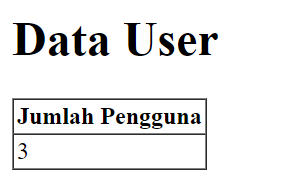

<div align=center>

# <strong> Laporan Praktikum Web Lanjut </strong>

## <strong>2241720107 | Denny Malik Ibrahim | 12 | TI-2H<br><hr>

# <strong> Jobsheet 2 <br> (Routing, Controller, dan View) </strong>

</div>

<br>

## Tugas

Home <br>
Menampilkan halaman awal website (route basic)<br>

<br>

Products <br>
Menampilkan daftar product (route prefix)<br>

<br>
<br>
<br>
<br>

User <br>
Menampilkan profil pengguna (route param)<br>

<br>

Transaksi <br>
Menampilkan halaman transaksi (route basic)<br>


<br>

<hr>
<br>
<br>

<div align=center>

# Jobsheet 3 <br> (Migration, Seeder, DB Facade, Query Builder, dan Eloquent ORM)

</div>

## 😊👉 [Laporan disini](laporan/Jobsheet-3_PWL_DennyMalikIbrahim_TI-2H.pdf) 👈😊

<br>
<hr>
<br>
<br>

<div align=center>

# Jobsheet 4 <br> (Model dan Eloquent ORM)

</div>

<br>

## A. PROPERTI $fillable DAN $guarded

### Praktikum 1 - $fillable

1. Menambahkan $fillable di model UserModel

    ```php
    protected $fillable = ['level_id', 'username', 'nama', 'password'];
    ```

2. Mengubah script pada UserController
    ```php
    public function index()
    {
        $data = [
            'level_id' => 2,
            'username' => 'manager_dua',
            'nama' => 'Manager 2',
            'password' => Hash::make('12345')
        ];
        UserModel::create($data);
        //coba akses model usermodel
        $user = UserModel::all(); //ambil semua data dari tabel m_user
        return view('user', ['data' => $user]);
    }
    ```
3. localhostPWL_POS/public/user<br>
   

    Terlihat ada penambahan data manager 2

4. Mengubah file model UserModel.php

    ```php
    protected $fillable = ['level_id', 'username', 'nama'];
    ```

5. Mengubah bagian array pada $data di UserController

    ```php
    'username' => 'manager_tiga',
    'nama' => 'Manager 3',
    ```

6. localhostPWL_POS/public/user<br>
   

    Terjadi error, karena field password tidak memiliki default valuenya

### $guarded

-- Kebalikan dari $fillable. Semua kolom yang ditambahkan ke $guarded akan **diabaikan** oleh Eloquent ketika melakukan **insert/ update**.
Secara default $guarded isinya array("*"),
berarti semua atribut tidak bisa diset melalui *mass assignment\*.

_Mass Assignment_ adalah fitur canggih yang menyederhanakan proses pengaturan beberapa
atribut model sekaligus, menghemat waktu dan tenaga.

## B. RETRIEVING SINGLE MODELS

### Praktikum 2.1 - Retrieving Single Models

1. Mengubah script pada UserController

    ```php
    $user = UserModel::find(1);
    ```

2. Mengubah view user.blade

    ```php
    <tr>
        <td>{{$data->user_id}} </td>
        <td>{{$data->username}} </td>
        <td>{{$data->nama}} </td>
        <td>{{$data->level_id}} </td>
    </tr>
    ```

3. Hasil<br>
   

4. Mengubah script pada UserController

    ```php
    $user = UserModel::where('level_id', 1)->first();
    ```

5. Hasil<br>
   

6. Mengubah script pada UserController

    ```php
    $user = UserModel::firstWhere('level_id', 1);
    ```

7. Hasil<br>
   <br>

    Ketiga cara diatas adalah cara yang berbeda dengan hasil yang sama<br>

    -- Tindakan lain jika tidak ada hasil lain yang ditemukan menggunakan metode **findOr** dan **firstOr** yang akan mengembalikan satu contoh model atau akan menjalankan didalam fungsi <br>

    ```php
     $user = UserModel::findOr(1, function(){
        // ...
    });

    $user = UserModel::where('level_id', '>', 3)->firstOr(function(){
        // ...
    });
    ```

8. Mengubah script pada UserController

    ```php
    $user = UserModel::findOr(1, ['username', 'nama'], function(){
            abort(404);
    });
    ```

9. Hasil<br>
   <br>

    Data yang keluar hanya username dan nama, pada level_id 1, karena hanya data dari 2 field tersebut yang diambil

10. Mengubah script pada UserController

    ```php
    $user = UserModel::findOr(20, ['username', 'nama'], function(){
            abort(404);
    });
    ```

11. Hasil<br>
    
    Jika tidak ada hasil yang diinginkan, maka akan menjalankan fungsi _abort(404)_

### Praktikum 2.2 - Not Found Exceptions

-- Metode findOrFail dan firstOrFail akan
mengambil hasil pertama dari kueri; namun, jika tidak ada hasil yang ditemukan, sebuah
Illuminate\Database\Eloquent\ModelNotFoundException akan dilempar

1. Mengubah script pada UserController

    ```php
    $user = UserModel::findOrFail(1);
    ```

2. Hasil<br>
   

3. Mengubah script pada UserController

    ```php
    $user = UserModel::where('username', 'manager9')->firstOrFail();
    ```

4. Hasil<br>
   <br>
   Di database tidak ada username 'manager9'

### Praktikum 2.3 - Retreiving Aggregrates

1. Mengubah script pada UserController

    ```php
    $user = UserModel::where('level_id', '2')->count();
    dd($user);
    ```

2. Hasil<br>
   <br>
   'level_id' yang bernilai 2 ada 3

3. Menampilkan seperti dibawah ini

    ```php
     <tr>
        <th>Jumlah Pengguna</th>
    </tr>
    <tr>
        <td>{{$data}}</td>
    </tr>
    ```

    Hasil<br>
    
