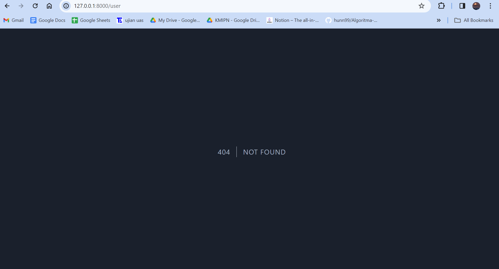
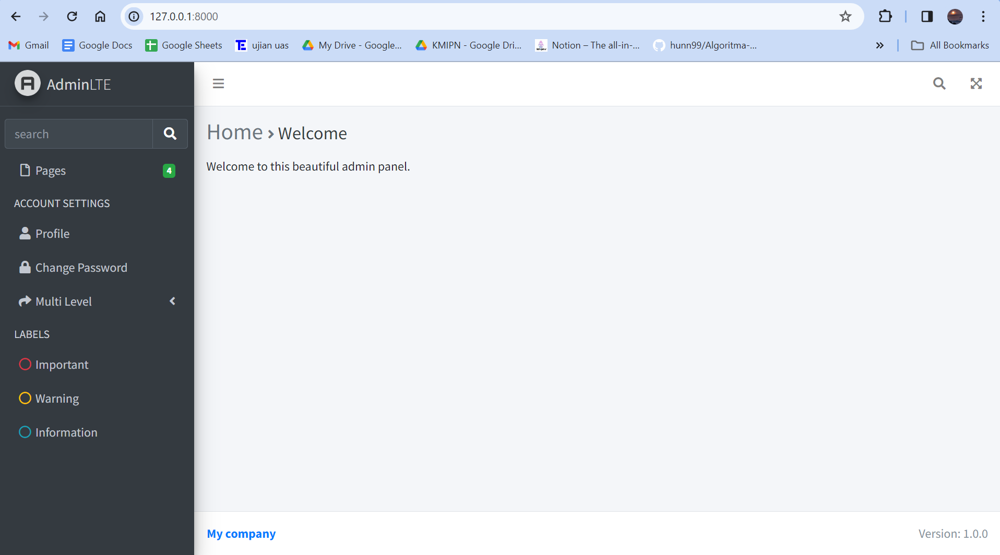
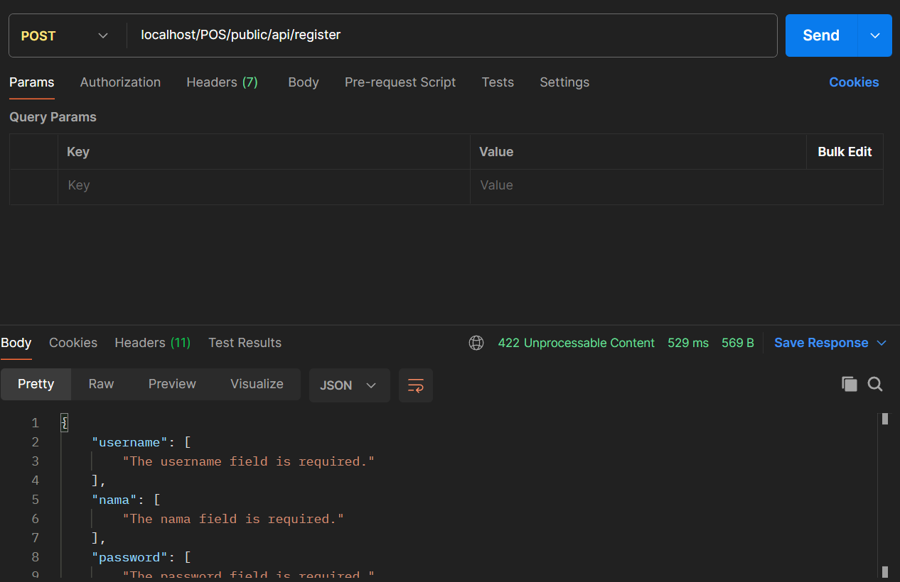

<div align=center>

# <strong> Laporan Praktikum Web Lanjut </strong>

## <strong>2241720107 | Denny Malik Ibrahim | 12 | TI-2H<br><hr>

# <strong> Jobsheet 2 <br> (Routing, Controller, dan View) </strong>

</div>

<br>

## Tugas

Home <br>
Menampilkan halaman awal website (route basic)<br>

<br>

Products <br>
Menampilkan daftar product (route prefix)<br>

<br>
<br>
<br>
<br>

User <br>
Menampilkan profil pengguna (route param)<br>

<br>

Transaksi <br>
Menampilkan halaman transaksi (route basic)<br>


<br>

<hr>
<br>
<br>

<div align=center>

# Jobsheet 3 <br> (Migration, Seeder, DB Facade, Query Builder, dan Eloquent ORM)

</div>

## 😊👉 [Laporan disini](laporan/Jobsheet-3_PWL_DennyMalikIbrahim_TI-2H.pdf) 👈😊

<br>
<hr>
<br>
<br>

<div align=center>

# Jobsheet 4 <br> (Model dan Eloquent ORM)

</div>

<br>

## A. PROPERTI $fillable DAN $guarded

### Praktikum 1 - $fillable

1. Menambahkan $fillable di model UserModel

    ```php
    protected $fillable = ['level_id', 'username', 'nama', 'password'];
    ```

2. Mengubah script pada UserController
    ```php
    public function index()
    {
        $data = [
            'level_id' => 2,
            'username' => 'manager_dua',
            'nama' => 'Manager 2',
            'password' => Hash::make('12345')
        ];
        UserModel::create($data);
        //coba akses model usermodel
        $user = UserModel::all(); //ambil semua data dari tabel m_user
        return view('user', ['data' => $user]);
    }
    ```
3. localhostPWL_POS/public/user<br>
   

    Terlihat ada penambahan data manager 2

4. Mengubah file model UserModel.php

    ```php
    protected $fillable = ['level_id', 'username', 'nama'];
    ```

5. Mengubah bagian array pada $data di UserController

    ```php
    'username' => 'manager_tiga',
    'nama' => 'Manager 3',
    ```

6. localhostPWL_POS/public/user<br>
   

    Terjadi error, karena field password tidak memiliki default valuenya

### $guarded

-- Kebalikan dari $fillable. Semua kolom yang ditambahkan ke $guarded akan **diabaikan** oleh Eloquent ketika melakukan **insert/ update**.
Secara default $guarded isinya array("*"),
berarti semua atribut tidak bisa diset melalui *mass assignment\*.

_Mass Assignment_ adalah fitur canggih yang menyederhanakan proses pengaturan beberapa
atribut model sekaligus, menghemat waktu dan tenaga.

## B. RETRIEVING SINGLE MODELS

### Praktikum 2.1 - Retrieving Single Models

1. Mengubah script pada UserController

    ```php
    $user = UserModel::find(1);
    ```

2. Mengubah view user.blade

    ```php
    <tr>
        <td>{{$data->user_id}} </td>
        <td>{{$data->username}} </td>
        <td>{{$data->nama}} </td>
        <td>{{$data->level_id}} </td>
    </tr>
    ```

3. Hasil<br>
   

4. Mengubah script pada UserController

    ```php
    $user = UserModel::where('level_id', 1)->first();
    ```

5. Hasil<br>
   

6. Mengubah script pada UserController

    ```php
    $user = UserModel::firstWhere('level_id', 1);
    ```

7. Hasil<br>
   <br>

    Ketiga cara diatas adalah cara yang berbeda dengan hasil yang sama<br>

    -- Tindakan lain jika tidak ada hasil lain yang ditemukan menggunakan metode **findOr** dan **firstOr** yang akan mengembalikan satu contoh model atau akan menjalankan didalam fungsi <br>

    ```php
     $user = UserModel::findOr(1, function(){
        // ...
    });

    $user = UserModel::where('level_id', '>', 3)->firstOr(function(){
        // ...
    });
    ```

8. Mengubah script pada UserController

    ```php
    $user = UserModel::findOr(1, ['username', 'nama'], function(){
            abort(404);
    });
    ```

9. Hasil<br>
   <br>

    Data yang keluar hanya username dan nama, pada level_id 1, karena hanya data dari 2 field tersebut yang diambil

10. Mengubah script pada UserController

    ```php
    $user = UserModel::findOr(20, ['username', 'nama'], function(){
            abort(404);
    });
    ```

11. Hasil<br>
    
    Jika tidak ada hasil yang diinginkan, maka akan menjalankan fungsi _abort(404)_

### Praktikum 2.2 - Not Found Exceptions

-- Metode findOrFail dan firstOrFail akan
mengambil hasil pertama dari kueri; namun, jika tidak ada hasil yang ditemukan, sebuah
Illuminate\Database\Eloquent\ModelNotFoundException akan dilempar

1. Mengubah script pada UserController

    ```php
    $user = UserModel::findOrFail(1);
    ```

2. Hasil<br>
   

3. Mengubah script pada UserController

    ```php
    $user = UserModel::where('username', 'manager9')->firstOrFail();
    ```

4. Hasil<br>
   <br>
   Di database tidak ada username 'manager9'

### Praktikum 2.3 - Retreiving Aggregrates

1. Mengubah script pada UserController

    ```php
    $user = UserModel::where('level_id', '2')->count();
    dd($user);
    ```

2. Hasil<br>
   <br>
   'level_id' yang bernilai 2 ada 3

3. Menampilkan seperti dibawah ini

    ```php
     <tr>
        <th>Jumlah Pengguna</th>
    </tr>
    <tr>
        <td>{{$data}}</td>
    </tr>
    ```

    Hasil<br>
    

### Praktikum 2.4 - Retreiving or Creating Models

1. Mengubah script pada UserController

    ```php
    $user = UserModel::firstOrCreate(
        [
            'username' => 'manager',
            'nama' => 'Manager',
        ],
    );
    ```

2. Mengubah view user

    ```php
    <tr>
        <th>ID</th>
        <th>Username</th>
        <th>Nama</th>
        <th>ID Level Pengguna</th>
    </tr>

    <tr>
        <td>{{$data->user_id}} </td>
        <td>{{$data->username}} </td>
        <td>{{$data->nama}} </td>
        <td>{{$data->level_id}} </td>
    </tr>
    ```

3. Hasil<br>
   <br>
   Karena username 'manager' sudah maka, firstoOrCreate hanya mengambil data yang ada

4. Mengubah script pada UserController

    ```php
    $user = UserModel::firstOrCreate(
        [
            'username' => 'manager22',
            'nama' => 'Manager Dua Dua',
            'password' => Hash::make('12345'),
            'level_id' => 2
        ],
    );
    ```

5. Hasil<br>
   <br>
   Karena tidak ada username 'manager22', maka firstoOrCreate memambahkan data tersebut

6. Mengubah script pada UserController

    ```php
    $user = UserModel::firstOrNew(
        [
                'username' => 'manager',
                'nama' => 'Manager',
        ],
    );
    ```

7. Hasil<br>
   <br>
   Hasilnya sama dengan firstOrCreate

8. Mengubah script pada UserController

    ```php
    $user = UserModel::firstOrNew(
        [
            'username' => 'manager33',
            'nama' => 'Manager Tiga Tiga',
            'password' => Hash::make('12345'),
            'level_id' => 2
        ],
    );
    ```

9. Hasil<br>
   <br>
   Username 'manager33' tidak ada di database, dan oleh firstOrNew data akan ditampilkan, namun belum disimpan ke database, oleh karena itu pada saat ditampilkan tidak ada ID nya

10. Mengubah script pada UserController

    ```php
    $user = UserModel::firstOrNew(
        [
           'username' => 'manager33',
            'nama' => 'Manager Tiga Tiga',
            'password' => Hash::make('12345'),
            'level_id' => 2
        ],
    );
    $user->save();
    ```

11. Hasil<br>
    <br>
    Pada firstOrNew perlu adanya tambahan metode save untuk secara manual di simpan di database

### Praktikum 2.5 - Attribute Changes

-- Eloquent menyediakan metode isDirty, isClean, dan wasChanged untuk memeriksa
keadaan internal model
Metode isDirty menentukan apakah ada atribut model yang telah diubah sejak model diambil
Metode isClean akan
menentukan apakah suatu atribut tetap tidak berubah sejak model diambil

1. Mengubah script pada UserController

    ```php
     $user = UserModel::create([
            'username' => 'manager55',
            'nama' => 'Manager55',
            'password' => Hash::make(12345),
            'level_id' => 2,
    ]);

    $user->username = 'manager56';

    $user->isDirty(); // true
    $user->isDirty('username'); // true
    $user->isDirty('nama'); // false
    $user->isDirty(['nama', 'username']); // true

    $user->isClean(); // false
    $user->isClean('username'); // false
    $user->isClean('nama'); // true
    $user->isClean(['nama', 'username']); // false

    $user->save();

    $user->isDirty(); // false
    $user->isClean(); // true
    dd($user->isDirty());
    ```

2. Hasil<br>
   <br>
   Output isDirty() akan false karena setelah di simpan tidak ada perubahan, karena isDirty menentukan apakah ada atribut model yang telah diubah sejak model diambil

3. Mengubah script pada UserController

    ```php
    $user = UserModel::create([
            'username' => 'manager11',
            'nama' => 'Manager11',
            'password' => Hash::make(12345),
            'level_id' => 2,
    ]);

    $user->username = 'manager12';

    $user->save();

    $user->wasChanged(); // true
    $user->wasChanged('username'); // true
    $user->wasChanged(['username', 'level_id']); // true
    $user->wasChanged('nama'); // false
    dd($user->wasChanged(['nama', 'username'])); //true
    ```

4. Hasil<br>
   <br>
   Hasilnya true karena wasChanged memeriksa keadaan internal model dan menentukan bagaimana atributnya berubah sejak model pertama kali diambil.

### Praktikum 2.6 - Create, Read, Update, Delete (CRUD)

1. Mengubah script pada view user

    ```php
    <body>
        <h1>Data User</h1>
        <a href="/user/tambah">+ Tambah User</a>
        <table border="1" cellpadding="2" cellspacing="0">
            <tr>
                <th>ID</th>
                <th>Username</th>
                <th>Nama</th>
                <th>ID Level Pengguna</th>
                <th>Aksi</th>
            </tr>
            @foreach ($data as $d)
                <tr>
                    <td>{{ $d->user_id }} </td>
                    <td>{{ $d->username }} </td>
                    <td>{{ $d->nama }} </td>
                    <td>{{ $d->level_id }} </td>
                    <td><a href="/user/ubah/{{ $d->user_id }}">Ubah</a> | <a href="/user/hapus/{{ $d->user_id }}">Hapus</a></td>
                </tr>
            @endforeach

        </table>
        </body>
    ```

2. Mengubah script pada UserController

    ```php
    $user = UserModel::all();
    return view('user', ['data' => $user]);
    ```

3. Hasil<br>
   <br>
   Terdapat aksi untuk tambah, ubah dan hapus. Tetapi jika di tekan akan error karena masih belum mendefinikan route, view, dan controllernya

4. Menambahkan file user_tambah pada view

    ```php
    <body>
        <h1>Form Tambah Data User</h1>
        <form method="post" action="/user/tambah_simpan">

            {{ csrf_field() }}

            <label for="">Username</label>
            <input type="text" name="username" placeholder="Masukan Username" >
            <br>
            <label for="">Nama</label>
            <input type="text" name="nama" placeholder="Masukan Nama">
            <br>
            <label for="">Password</label>
            <input type="password" name="password" placeholder="Masukan Password">
            <br>
            <label for="">Level ID</label>
            <input type="number" name="level_id" placeholder="Masukan ID Level">
            <br><br>
            <input type="submit" class="btn btn-success" value="Simpan">
        </form>
    </body>
    ```

5. Menambah script pada route

    ```php
    Route::get('/user/tambah', [UserController::class, 'tambah']);
    ```

6. Menambah script pada UserController

    ```php
    public function tambah()
    {
        return view('user_tambah');
    }
    ```

7. Hasil<br>
   

8. Menambah script pada route

    ```php
    Route::get('/user/tambah_simpan', [UserController::class, 'tambah_simpan']);
    ```

9. Menambah script pada UserController

    ```php
    public function tambah_simpan(Request $request)
    {
        UserModel::create([
            'username' => $request->username,
            'nama' => $request->nama,
            'password' => Hash::make('$request->password'),
            'level_id' => $request->level_id
        ]);

        return redirect('/user');
    }
    ```

10. Hasil<br>
    <br>
    <br>
    Setelah mengisi form akan kembali ke halaman user dan terlihat ada data yang ditambahkan

11. Membuat update atau ubah data user

    ```php
    <body>
    <h1>Form Ubah Data User</h1>
    <a href="/user">Kembali</a>
    <br><br>

    <form action="/user/ubah_simpan/{{ $data->user_id }}" method="post">

        {{ csrf_field() }}
        {{ method_field('PUT') }}

        <label for="">Username</label>
        <input type="text" name="username" placeholder="Masukan Username" value="{{ $data->username }}">
        <br>
        <label for="">Nama</label>
        <input type="text" name="nama" placeholder="Masukan Nama" value="{{ $data->nama }}">
        <br>
        <label for="">Password</label>
        <input type="password" name="password" placeholder="Masukan Password" value="{{ $data->password }}">
        <br>
        <label for="">Level ID</label>
        <input type="number" name="level_id" placeholder="Masukan ID Level" value="{{ $data->level_id }}">
        <br><br>
        <input type="submit" class="btn btn-success" value="Ubah">

    </form>
    </body>
    ```

12. Menambah script pada routes

    ```php
    Route::get('/user/ubah/{id}', [UserController::class, 'ubah']);
    ```

13. Menambah script pada UserController

    ```php
    public function ubah($id)
    {
        $user = UserModel::find($id);
        return view('user_ubah', ['data' => $user]);
    }
    ```

14. Hasil<br>
    <br>

15. Menambah script pada routes

    ```php
    Route::put('/user/ubah_simpan/{id}', [UserController::class, 'ubah_simpan']);
    ```

16. Menambah script pada UserController

    ```php
    public function ubah_simpan($id, Request $request)
    {
        $user = UserModel::find($id);

        $user->username = $request->username;
        $user->nama = $request->nama;
        $user->password = Hash::make('$request->password');
        $user->level_id = $request->level_id;

        $user->save();

        return redirect ('/user');
    }
    ```

17. Hasil<br>
    <br>
    Mengubah level_id menjadi 2

    <br>
    Setelah mengubah kembali ke halaman user dengan level_id denny berubah jadi 2

18. Menambah script pada routes

    ```php
    Route::get('/user/hapus/{id}', [UserController::class, 'hapus']);
    ```

19. Menambah script pada UserController

    ```php
    public function hapus($id)
    {
        $user = UserModel::find($id);
        $user->delete();

        return redirect('/user');
    }
    ```

20. Hasil<br>
    <br>
    <br>
    Data denny telah dihapus

### Praktikum 2.7 - Relationships

1. Menambah script pada UserModel

    ```php
    public function level(): BelongsTo
    {
        return $this->belongsTo(LevelModel::class, 'level_id', 'level_id');
    }
    ```

    Lalu membuat model LevelModel dan mengisinya seperti UserModel

2. Mengubah script pada UserController

    ```php
    public function index()
    {
        $user = UserModel::with('level')->get();
        dd($user);
    }
    ```

3. Hasil<br>
   

4. Mengubah script pada UserController

    ```php
    public function index()
    {
        $user = UserModel::with('level')->get();
        return view('user', ['data' => $user]);
    }
    ```

5. Mengubah script view user

    ```php
    <body>
    <h1>Data User</h1>
    <a href="/user/tambah">+ Tambah User</a>
    <table border="1" cellpadding="2" cellspacing="0">
        <tr>
            <th>ID</th>
            <th>Username</th>
            <th>Nama</th>
            <th>ID Level Pengguna</th>
            <th>Kode Level</th>
            <th>Nama Level</th>
            <th>Aksi</th>
        </tr>
        @foreach ($data as $d)
            <tr>
                <td>{{ $d->user_id }} </td>
                <td>{{ $d->username }} </td>
                <td>{{ $d->nama }} </td>
                <td>{{ $d->level_id }} </td>
                <td>{{ $d->level->level_kode }} </td>
                <td>{{ $d->level->level_nama }} </td>
                <td><a href="/user/ubah/{{ $d->user_id }}">Ubah</a> | <a
                        href="/user/hapus/{{ $d->user_id }}">Hapus</a></td>
            </tr>
        @endforeach

    </table>
    </body>
    ```

6. Hasil<br>
   <br>
   Terlihat ada penambahan kolom level kode dan level nama yang diambil dari tabel m_level

<br>
<hr>
<br>
<br>

<div align=center>

# Jobsheet 5 <br> (Blade View, Web Templating(AdminLTE), Datatables)

</div>

<br>

##

### Praktikum 1 – Integrasi Laravel dengan AdminLte3

1. Menjalankan command (composer require jeroennoten/laravel-adminlte), untuk mendefinisikan requirement project <br>
   <br>

2. Melakukan instalasi requirement project di atas dengan command (php artisan adminlte:install)<br>
   <br>

3. Membuat file resources/views/layout/app.blade.php<br>
   <br>
   dan mengisi dengan kode berikut:

    ```php
    @extends('adminlte::page')
    {{-- Extend and customize the browser title --}}
    @section('title')
        {{ config('adminlte.title') }}
        @hasSection('subtitle')
            | @yield('subtitle')
        @endif
    @stop
    {{-- Extend and customize the page content header --}}
    @section('content_header')
        @hasSection('content_header_title')
            <h1 class="text-muted">
                @yield('content_header_title')
                @hasSection('content_header_subtitle')
                    <small class="text-dark">
                        <i class="fas fa-xs fa-angle-right text-muted"></i>
                        @yield('content_header_subtitle')
                    </small>
                @endif
            </h1>
        @endif
    @stop
    {{-- Rename section content to content_body --}}
    @section('content')
        @yield('content_body')
    @stop
    {{-- Create a common footer --}}
    @section('footer')
        <div class="float-right">
            Version: {{ config('app.version', '1.0.0') }}
        </div>
        <strong>
            <a href="{{ config('app.company_url', '#') }}">
                {{ config('app.company_name', 'My company') }}
            </a>
        </strong>
    @stop
    {{-- Add common Javascript/Jquery code --}}
    @push('js')
        <script>
            $(document).ready(function() {
                // Add your common script logic here...
            });
        </script>
    @endpush
    {{-- Add common CSS customizations --}}
    @push('css')
        <style type="text/css">
            {{-- You can add AdminLTE customizations here --}}
            /*
            .card-header {
                border-bottom: none;
            }
            .card-title {
                font-weight: 600;
            }
            */
        </style>
    @endpush
    ```

4. Mengedit resources/views/welcome.blade.php dan mereplace dengan kode berikut

5. Menuju ke browser
   

### Praktikum 2 – Integrasi dengan DataTables

1. Menginstall laravel data tabel<br>

    - composer require laravel/ui --dev
    - composer require yajra/laravel-datatables:^10.0<br>

    <br>
    <br>

2. Melakukan perintah npm -v<br>
   <br>

3. Menginstall Laravel DataTables Vite dan sass<br>

    - npm i laravel-datatables-vite --save-dev
    - npm install -D sass<br>

    <br>
    

4. Mengedit file resources/js/app.js

    ```php
    import './bootstrap';
    import "../sass/app.scss";
    import 'laravel-datatables-vite';
    ```

5. Membuat file resources/saas/app.scss

    ```php
    // Fonts
    @import url('https://fonts.bunny.net/css?family=Nunito');


    // Bootstrap
    @import 'bootstrap/scss/bootstrap';

    // DataTables
    @import 'bootstrap-icons/font/bootstrap-icons.css';
    @import "datatables.net-bs5/css/dataTables.bootstrap5.min.css";
    @import "datatables.net-buttons-bs5/css/buttons.bootstrap5.min.css";
    @import 'datatables.net-select-bs5/css/select.bootstrap5.css';
    ```

6. Menjalankan npm run dev<br>
   <br>

7. Membuat datatables untuk kategori<br>
   

8. Mengedit KategoriDatable untuk mengatur kolom apasaja yang ingin ditampilkan<br>

    ```php
    <?php

    namespace App\DataTables;

    use App\Models\KategoriModel;
    use Illuminate\Database\Eloquent\Builder as QueryBuilder;
    use Yajra\DataTables\EloquentDataTable;
    use Yajra\DataTables\Html\Builder as HtmlBuilder;
    use Yajra\DataTables\Html\Button;
    use Yajra\DataTables\Html\Column;
    use Yajra\DataTables\Html\Editor\Editor;
    use Yajra\DataTables\Html\Editor\Fields;
    use Yajra\DataTables\Services\DataTable;

    class KategoriDataTable extends DataTable
    {
        /**
         * Build the DataTable class.
         *
         * @param QueryBuilder $query Results from query() method.
         */
        public function dataTable(QueryBuilder $query): EloquentDataTable
        {
            return (new EloquentDataTable($query))
    /*             ->addColumn('action', 'kategori.action') */
                ->setRowId('id');
        }

        /**
         * Get the query source of dataTable.
         */
        public function query(KategoriModel $model): QueryBuilder
        {
            return $model->newQuery();
        }

        /**
         * Optional method if you want to use the html builder.
         */
        public function html(): HtmlBuilder
        {
            return $this->builder()
                        ->setTableId('kategori-table')
                        ->columns($this->getColumns())
                        ->minifiedAjax()
                        //->dom('Bfrtip')
                        ->orderBy(1)
                        ->selectStyleSingle()
                        ->buttons([
                            Button::make('excel'),
                            Button::make('csv'),
                            Button::make('pdf'),
                            Button::make('print'),
                            Button::make('reset'),
                            Button::make('reload')
                        ]);
        }

        /**
         * Get the dataTable columns definition.
         */
        public function getColumns(): array
        {
            return [
        /*         Column::computed('action')
                    ->exportable(false)
                    ->printable(false)
                    ->width(60)
                    ->addClass('text-center'), */
                Column::make('kategori_id'),
                Column::make('kategori_kode'),
                Column::make('kategori_nama'),
                Column::make('created_at'),
                Column::make('updated_at'),
            ];
        }

        /**
         * Get the filename for export.
         */
        protected function filename(): string
        {
            return 'Kategori_' . date('YmdHis');
        }
    }
    ```

9. Mengubah kategori model

    ```php
    <?php

    namespace App\Models;

    use Illuminate\Database\Eloquent\Model;
    use Illuminate\Database\Eloquent\Relations\HasMany;

    class KategoriModel extends Model
    {
        protected $table = 'm_kategori';
        protected $primaryKey = 'kategori_id';
        protected $fillable = ['kategori_kode', 'kategori_nama'];

        public function barang(): HasMany
        {
            return $this->hasMany(BarangModel::class, 'barang_id', 'barang_id');
        }
    }
    ```

10. Mengubah Kategori Controller

    ```php
        public function index(KategoriController $dataTable)
        {
            return $dataTable->render('kategori.index');
        }
    ```

11. Membuat folder kategori di view

    ```php
    @extends('layouts.app')

    {{-- Customize layout sections --}}

    @section('subtitle', 'Kategori')
    @section('content_header_title', 'Home')
    @section('content_header_subtitle', 'Kategori')

    @section('content')
        <div class="container">
            <div class="card">
                <div class="card-header">Manage Kategori</div>
                <div class="card-body">
                    {{ $dataTable->table() }}
                </div>
            </div>
        </div>
    @endsection

    @push('scripts')
        {{ $dataTable->scripts() }}
    @endpush
    ```

12. Memastikan route kategori tersedia

    ```php
    Route::get('/kategori', [KategoriController::class, 'index']);
    ```

13. Menyesuaikan app layout

    ```php
    @extends('adminlte::page')
    {{-- Extend and customize the browser title --}}
    @section('title')
        {{ config('adminlte.title') }}
        @hasSection('subtitle')
            | @yield('subtitle')
        @endif
    @stop
    @vite('resources/js/app.js')
    {{-- Extend and customize the page content header --}}
    @section('content_header')
        @hasSection('content_header_title')
            <h1 class="text-muted">
                @yield('content_header_title')
                @hasSection('content_header_subtitle')
                    <small class="text-dark">
                        <i class="fas fa-xs fa-angle-right text-muted"></i>
                        @yield('content_header_subtitle')
                    </small>
                @endif
            </h1>
        @endif
    @stop

    {{-- Rename section content to content_body --}}

    @section('content')
        @yield('content_body')
    @stop


    {{-- Create a common footer --}}

    @section('footer')
        <div class="float-right">
            Version: {{ config('app.version', '1.0.0') }}
        </div>

        <strong>
            <a href="{{ config('app.company_url', '#') }}">
                {{ config('app.company_name', 'My company') }}
            </a>
        </strong>
    @stop


    {{-- Add common Javascript/Jquery code --}}


    @push('js')
        <script src="https://cdn.datatables.net/2.0.2/js/dataTables.js"></script>
    @endpush

    @stack('scripts')


    {{-- Add common CSS customizations --}}

    @push('css')
        <link rel="stylesheet" href="https://cdn.datatables.net/2.0.2/css/dataTables.dataTables.css" />
        <style type="text/css">
            {{-- You can add AdminLTE customizations here --}}
            /*
        .card-header {
        border-bottom: none;
        }
        .card-title {
        font-weight: 600;
        }
        */
        </style>
    @endpush
    ```

14. Menset ViteJs / script type defaults

    ```php
    <?php

    namespace App\Providers;

    use Illuminate\Support\ServiceProvider;
    use Yajra\DataTables\Html\Builder;

    class AppServiceProvider extends ServiceProvider
    {
        /**
         * Register any application services.
         */
        public function register(): void
        {
            //
        }

        /**
         * Bootstrap any application services.
         */
        public function boot(): void
        {
            Builder::useVite();
        }
    }
    ```

15. Melihat data kategori
    

### Praktikum 3 – Membuat form kemudian menyimpan data dalam database

1. Menambahkan 2 routing

    ```php
    Route::get('/kategori/create', [KategoriController::class, 'create']);
    Route::post('/kategori', [KategoriController::class, 'store']);
    ```

2. Menambahkan 2 function dalam KategoriController

    ```php
        public function create()
        {
            return view('kategori.create');
        }

        public function store(Request $request)
        {
            KategoriModel::create([
                'kategori_kode' => $request->kodeKategori,
                'kategori_nama' => $request->namaKategori,
            ]);
            return redirect('/kategori');
        }
    ```

3. Membuat file create.blade di views/kategori

    ```php
    @extends('layouts.app')

    {{-- Customize layout sections --}}

    @section('subtitle', 'Kategori')
    @section('content_header_title', 'Kategori')
    @section('content_header_subtitle', 'Create')

    @section('content')
        <div class="container">
            <div class="card card-primary">
                <div class="card-header">
                    <h3 class="card-title">Buat Kategori Baru</h3>
                </div>

                <form action="../kategori" method="post">
                    <div class="card-body">
                        <div class="form-group">
                            <label for="kodeKategori">Kode Kategori</label>
                            <input type="text" class="form-control" name="kodeKategori" id="kodeKategori" placeholder="Masukkan kode kategori">
                        </div>
                        <div class="form-group">
                            <label for="namaKategori">Nama Kategori</label>
                            <input type="text" class="form-control" name="namaKategori" id="namaKategori" placeholder="Masukkan nama kategori">
                        </div>
                    </div>

                    <div class="card-footer">
                        <button type="submit" class="btn btn-primary">Submit</button>
                    </div>
                </form>
            </div>
        </div>
    @endsection
    ```

4. Melakukan pengecualian proteksi CsrfToken pada file VerifyCsrfToken

    ```php
    protected $except = [
            '/kategori'
    ];
    ```

5. Mengakses kategori/create<br>
   

6. Mengakses halaman kategori<br>
   

### Tugas Praktikum

1. Menambah button Add di halaman manage kategori yang mengarah ke create kategori baru

    ```php
    @section('content')
        <div class="container">
            <div class="card">
                <div class="card-header">Manage Kategori</div>
                <div class="card-body">
                    {{ $dataTable->table() }}
                </div>
            </div>
            <a href="/kategori/create">
            <button class="btn btn-primary float-end">
                Tambah
            </button>
            </a>
        </div>
    @endsection
    ```

    Hasil<br>
    

2. Menambahkan menu untuk halaman manage kategori di daftar menu sidebar

    ```php
    [
                'text' => 'Manage Kategori',
                'url' => 'kategori',
            ],
    ```

    

3. Menambahkan action edit di datatables dan buat halaman edit serta controllernya

    ```php
        public function dataTable(QueryBuilder $query): EloquentDataTable
        {
            return (new EloquentDataTable($query))
                ->addColumn('action', function ($kategori) {
                    return '<a href = "' . route('kategori.edit', $kategori->kategori_id) . '" class = "btn btn-primary">Edit</a>';
                })
                ->setRowId('id');
        }
    ```

    ```php
        public function getColumns(): array
        {
            return
                [
                    Column::make('kategori_id'),
                    Column::make('kategori_kode'),
                    Column::make('kategori_nama'),
                    Column::make('created_at'),
                    Column::make('updated_at'),
                    Column::make('action')
                        ->exportable(false)
                        ->printable(false)
                        ->width(60)
                        ->addClass('text-center')
                        ->title('Actions'),
                ];
        }
    ```

    ```php
    @extends('layouts.app')

    @section('subtitle', 'Kategori')
    @section('content_header_title', 'Kategori')
    @section('content_header_subtitle', 'Edit')

    @section('content')
    <div class="container">
        <div class="card card-primary">
            <div class="card-header">Edit Kategori</div>

            <div class="card-body">
                <form action="{{ route('kategori.update', $kategori->kategori_id) }}" method="POST">
                    @csrf
                    @method('PUT')

                    <div class="form-group">
                        <label for="kategori_kode">Kode Kategori:</label>
                        <input type="text" class="form-control" id="kategori_kode" name="kategori_kode" value="{{ $kategori->kategori_kode }}">
                    </div>

                    <div class="form-group">
                        <label for="kategori_nama">Nama Kategori:</label>
                        <input type="text" class="form-control" id="kategori_nama" name="kategori_nama" value="{{ $kategori->kategori_nama }}">
                    </div>

                    <button type="submit" class="btn btn-primary">Update</button>
                </form>
            </div>
        </div>
    </div>
    @endsection
    ```

    ```php
    Route::get('/kategori/{kategori}/edit', [KategoriController::class, 'edit'])->name('kategori.edit');
    Route::put('/kategori/{kategori}/update', [KategoriController::class, 'update'])->name('kategori.update');
    ```

    <br>
    <br>
    <br>

4. Menambahkan action delete di datatables serta controllernya

    ```php
        public function dataTable(QueryBuilder $query): EloquentDataTable
        {
            return (new EloquentDataTable($query))
                ->addColumn('action', function ($kategori) {
                    return '<a href="' . route('kategori.edit', $kategori->kategori_id) . '" class="btn btn-primary">Edit</a>
                        <form action="' . route('kategori.destroy', $kategori->kategori_id) . '" method="POST" style="display: inline;">
                            ' . csrf_field() . '
                            ' . method_field('DELETE') . '
                            <button type="submit" class="btn btn-danger">Delete</button>
                        </form>';
                })
                ->setRowId('id');
        }
    ```

    ```php
        public function destroy($id)
        {
            $kategori = KategoriModel::find($id);
            $kategori->delete();

            return redirect('/kategori');
        }
    ```

    

    

<br>
<hr>
<br>
<br>

<div align=center>

# Jobsheet 6 <br> (Template Form (AdminLTE), Server Validation, Client Validation, CRUD)

</div>

<br>

## A. Template Form (AdminLTE)

1. Mengakses https://adminlte.io/ , lalu klik download pada source code (zip) dan memindahkannya pada folder public <br>
   

2. Mengcopy isi public/template/index2.html pada welcome.blade.php

    ```php
    <link rel="stylesheet" href="{{ asset('template/plugins/fontawesome-free/css/all.min.css') }}">
    <!-- overlayScrollbars -->
    <link rel="stylesheet" href="{{ asset('template/plugins/overlayScrollbars/css/OverlayScrollbars.min.css') }}">
    <!-- Theme style -->
    <link rel="stylesheet" href="{{ asset('template/dist/css/adminlte.min.css') }}">

    

    ```

3. Menyesuaikan kode

    ```php
    <!-- REQUIRED SCRIPTS -->
    <!-- jQuery -->
    <script src="{{ asset('template/plugins/jquery/jquery.min.js') }}"></script>
    <!-- Bootstrap -->
    <script src="{{ asset('template/plugins/bootstrap/js/bootstrap.bundle.min.js') }} "></script>
    <!-- overlayScrollbars -->
    <script src="{{ asset('template/plugins/overlayScrollbars/js/jquery.overlayScrollbars.min.js') }}  "></script>
    <!-- AdminLTE App -->
    <script src="{{ asset('template/dist/js/adminlte.js') }} "></script>

    <!-- PAGE PLUGINS -->
    <!-- jQuery Mapael -->
    <script src="{{ asset('template/plugins/jquery-mousewheel/jquery.mousewheel.js') }} "></script>
    <script src="{{ asset('template/plugins/raphael/raphael.min.js') }} "></script>
    <script src="{{ asset('template/plugins/jquery-mapael/jquery.mapael.min.js') }} "></script>
    <script src="{{ asset('template/plugins/jquery-mapael/maps/usa_states.min.js') }} "></script>
    <!-- ChartJS -->
    <script src="{{ asset('template/plugins/chart.js/Chart.min.js') }} "></script>

    <!-- AdminLTE for demo purposes -->
    <script src="{{ asset('template/dist/js/demo.js') }} "></script>
    <!-- AdminLTE dashboard demo (This is only for demo purposes) -->
    <script src="{{ asset('template/dist/js/pages/dashboard2.js') }} "></script>
    ```

4. Menjalankan browser<br>
   

5. Modifikasi welcome.blade

    ```php
    @extends('adminlte::page')

    @section('title', 'Dashboard')

    @section('content_header')
        <h1>Dashboard</h1>
    @stop

    @section('content')

        <div class="card-body">
            <form>
            <div class="row">
                <div class="col-sm-6">
                <!-- text input -->
                <div class="form-group">
        <label>Level id</label><input type="text" class="form-control" placeholder="id">
                    <div>
                </div>
                <button type = "submit" class ="btn btn-info">Submit </button>
                </div>
    @stop

    @section('css')
        {{-- Add here extra stylesheets --}}
        {{-- <link rel="stylesheet" href="/css/admin_custom.css"> --}}
    @stop

    @section('js')
        <script> console.log("Hi, I'm using the Laravel-AdminLTE package!"); </script>
    @stop
    ```

6. Hasil tampilan<br>
   

7. General form<br>
   

8. m_user<br>
   

9. m_level<br>
   

## B. Validasi Pada Seeder

1. Mengedit KategoriController

    ```php
    public function create(): View
    {
        return view('kategori.create');
    }

    public function store(Request $request): RedirectResponse
    {
        $validated = $request->validate([
            'kategori_kode' => 'required',
            'kategori_nama' => 'required',
        ]);
        return redirect('/kategori');
    }
    ```

2. Tulis perbedaan penggunaan validate dengan validateWithBag!<br>

-   Metode validate() biasanya digunakan di dalam controller. Jika validasi gagal, Laravel
    secara otomatis akan mengarahkan kembali pengguna ke halaman sebelumnya dengan
    pesan error yang sesuai. Pesan error validasi akan dikirim kembali ke tampilan dan dapat
    diakses menggunakan fungsi bantuan errors().
    -> Metode validateWithBag() memberikan fleksibilitas yang lebih besar dalam menangani
    pesan error validasi. Dengan menggunakan metode ini, dapat mengontrol di mana pesan
    error validasi disimpan dan bagaimana pesan tersebut ditampilkan kepada pengguna.

3. Menggunakan bail untuk menghentikan validasi pada field setelah kegagalan validasi pertama,
   Sehingga, jika validasi untuk kode_kategori gagal, maka Laravel akan menghentikan validasi
   dan tidak mengevaluasi aturan validasi untuk nama_kategori

    ```php
    $validated = $request->validate([
                'kategori_kode' => 'bail|required',
                'kategori_nama' => 'required',
            ]);
    ```

4. Pada view/create.blade.php tambahkan code berikut agar ketika validasi gagal, kita dapat menampilkan pesan kesalahan dalam tampilan

    ```php
    @if ($errors->any())
            <div class="alert alert-danger">
                <ul>
                    @foreach ($errors->all() as $error)
                        <li>{{ $error }}</li>
                    @endforeach
                </ul>
            </div>
        @endif
    ```

5. Hasil<br>
   

6. Menambahkan kode pada view/create.blade.php

    ```php
    <label for="kategori_kode">Kode Kategori</label>
                        <input type="text"
                            name="kategori_kode"
                            id="kategori_kode"
                            class="@error('kategori_kode') is-invalid @enderror form-control"
                            placeholder="Kode Kategori">

                        @error('kategori_kode')
                            <div class="alert alert-danger">{{ $message }}</div>
                        @enderror
    ```

    <br>

    

## C. Form Request Validation

1. Membuat permintaan form dengan menuliskan pada terminal<br>
   

2. Menambahkan kode pada Http/request/StorePostRequest

    ```php
    public function rules(): array
        {
            return [
                'kategori_kode' => 'required',
                'kategori_nama' => 'required',
            ];
        }

    public function store(StorePostRequest $request): RedirectResponse
    {
        // $validate = $request->validate([
        //     'kategori_kode' => 'bail|required',
        //     'kategori_nama' => 'required',
        // ]);

        // Retrieve the validated input data...
        $validated = $request->validated();

        // Retrieve a portion of the validated input data...
        $validated = $request->safe()->only(['kategori_kode', 'kategori_nama']);
        $validated = $request->safe()->except(['kategori_kode', 'kategori_nama']);

        KategoriModel::create([
            'kategori_kode' => $request->kategori_kode,
            'kategori_nama' => $request->kategori_nama,
        ]);
        return redirect('/kategori');
    }
    ```

3. Menerapkan pada m_user dan m_level<br>
   m_user<br>
   <br>

    m_level<br>
    <br>

## D. CRUD (Create, Read, Update, Delete)

1. Membuat POSController lengkap dengan resourcenya, Membuat Resource Controller dan Route
   yang berfungsi untuk route CRUD sehingga tidak perlu repot-repot membuat masing-masing
   route seperti post, get, delete dan update<br>
   

2. Menambahkan kode pada route

    ```php
    Route::recourse('m_user', POSController::class);
    ```

3. Mengatur model m_user

    ```php
    class UserModel extends Model
    {
        use HasFactory;

        protected $table = 'm_user';        // mendefinisikan nama tabel yang digunakan oleh model ini
        public $timestamps = false;
        protected $primaryKey = 'user_id';  // mendefinisikan primary key dari tabel yang digunakan

        protected $fillable = [
            'user_id',
            'level_id',
            'username',
            'nama',
            'password',
        ];
    ```

4. Mengatur migration m_user_table

    ```php
    public function up(): void
        {
            Schema::create('m_user', function (Blueprint $table) {
                $table->id('user_id');
                $table->unsignedBigInteger('level_id')->index(); // indexing for foreign key
                $table->string('username', 20)->unique(); // unique untuk memastikan tidak ada username yang sama
                $table->string('nama', 100);
                $table->string('password');
                $table->timestamps();

                // mendefinisikan foreign key pada kolom level_id mengace pada kolom level_id di tabel m_level
                $table->foreign('level_id')->references('level_id')->on('m_level');
            });
        }
    ```

5. Mengedit app/Http/Controllers/POSController.php

    ```php
    /**
         * Display a listing of the resource.
         */
        public function index()
        {
            // fungsi eloquent menampilkan data menggunakan pagination
            $useri = UserModel::all(); // Mengambil semua isi tabel
            return view('m_user.index', compact('useri'))->with('i');
        }

        /**
         * Show the form for creating a new resource.
         */
        public function create()
        {
            return view('m_user.create');
        }
    ```

6. Membuat folder di Resources/Views/m_user dengan beberapa blade dan isian kode berikut

    1. template.blade.php

        ```php
        <!DOCTYPE html>
        <html>
        <head>
            <title>CRUD Laravel</title>
            <link rel="stylesheet" href="https://maxcdn.bootstrapcdn.com/bootstrap/4.0.0/css/bootstrap.min.css">
        </head>
        <body>
            <div class="container">
                @yield('content')
            </div>
        </body>
        </html>
        ```

    2. index.blade.php

        ```php
        @extends('m_user/template')

        @section('content')
            <div class="row mt-5 mb-5">
                <div class="col-lg-12 margin-tb">
                    <div class="float-left">
                        <h2>CRUD user</h2>
                    </div>
                    <div class="float-right">
                        <a class="btn btn-success" href="{{ route('m_user.create') }}">Input User</a>
                    </div>
                </div>
            </div>

            @if ($message = Session::get('success'))
                <div class="alert alert-success">
                    <p>{{ $message }}</p>
                </div>
            @endif

            <table class="table table-bordered">
                <tr>
                    <th width="20px" class="text-center">User id</th>
                    <th width="150px" class="text-center">Level id</th>
                    <th width="200px" class="text-center">Username</th>
                    <th width="200px" class="text-center">Nama</th>
                    <th width="150px" class="text-center">Password</th>
                </tr>
                @foreach ($useri as $m_user)
                    <tr>
                        <td>{{ $m_user->user_id }}</td>
                        <td>{{ $m_user->level_id }}</td>
                        <td>{{ $m_user->username }}</td>
                        <td>{{ $m_user->nama }}</td>
                        <td>{{ substr($m_user->password, 0, 10) . "..." }}</td>
                        <td class="text-center">
                            <form action="{{ route('m_user.destroy', $m_user->user_id) }}" method="POST">
                                <a class="btn btn-info btn-sm" href="{{ route('m_user.show', $m_user->user_id) }}">Show</a>
                                <a class="btn btn-primary btn-sm" href="{{ route('m_user.edit', $m_user->user_id) }}">Edit</a>
                                @csrf
                                @method('DELETE')
                                <button type="submit" class="btn btn-danger btn-sm" onclick="return confirm('Apakah Anda yakin ingin menghapus data ini?')">Delete</button>
                            </form>
                        </td>
                    </tr>
                @endforeach
            </table>
        @endsection
        ```

    3. create.blade.php

        ```php
        @extends('m_user/template')

        @section('content')
            <div class="row mt-5 mb-5">
                <div class="col-lg-12 margin-tb">
                    <div class="float-left">
                        <h2>Membuat Daftar User</h2>
                    </div>
                    <div class="float-right">
                        <a class="btn btn-secondary" href="{{ route('m_user.index') }}">Kembali</a>
                    </div>
                </div>
            </div>

            @if ($errors->any())
                <div class="alert alert-danger">
                    <strong>Ops</strong> Input gagal<br><br>
                    <ul>
                        @foreach ($errors->all() as $error)
                            <li>{{ $error }}</li>
                        @endforeach
                    </ul>
                </div>
            @endif

            <form action="{{ route('m_user.store') }}" method="POST">
                @csrf
                <div class="col-xs-12 col-sm-12 col-md-12">
                    <div class="form-group">
                        <strong>Username:</strong>
                        <input type="text" name="username" class="form-control" placeholder="Masukkan username">
                    </div>
                </div>
                <div class="col-xs-12 col-sm-12 col-md-12">
                    <div class="form-group">
                        <strong>Nama:</strong>
                        <input type="text" name="nama" class="form-control" placeholder="Masukkan nama">
                    </div>
                </div>
                <div class="col-xs-12 col-sm-12 col-md-12">
                    <div class="form-group">
                        <strong>Password:</strong>
                        <input type="password" name="password" class="form-control" placeholder="Masukkan password">
                    </div>
                </div>
                <div class="col-xs-12 col-sm-12 col-md-12">
                    <div class="form-group">
                        <strong>Level ID:</strong>
                        <input type="number" name="level_id" class="form-control" placeholder="Masukkan level id">
                    </div>
                </div>
                <div class="col-xs-12 col-sm-12 col-md-12 text-center">
                    <button type="submit" class="btn btn-primary">Submit</button>
                </div>
            </form>
        @endsection
        ```

    4. show.blade.php

        ```php
        @extends('m_user/template')

        @section('content')
            <div class="row mt-5 mb-5">
                <div class="col-lg-12 margin-tb">
                    <div class="float-left">
                        <h2>Show User</h2>
                    </div>
                    <div class="float-right">
                        <a class="btn btn-secondary" href="{{ route('m_user.index') }}">Kembali</a>
                    </div>
                </div>
            </div>

            <div class="row">
                <div class="col-xs-12 col-sm-12 col-md-12">
                    <div class="form-group">
                        <strong>User_id:</strong>
                        {{ $useri->user_id }}
                    </div>
                </div>
                <div class="col-xs-12 col-sm-12 col-md-12">
                    <div class="form-group">
                        <strong>Level_id:</strong>
                        {{ $useri->level_id }}
                    </div>
                </div>
                <div class="col-xs-12 col-sm-12 col-md-12">
                    <div class="form-group">
                        <strong>Username:</strong>
                        {{ $useri->username }}
                    </div>
                </div>
                <div class="col-xs-12 col-sm-12 col-md-12">
                    <div class="form-group">
                        <strong>Nama:</strong>
                        {{ $useri->nama }}
                    </div>
                </div>
                <div class="col-xs-12 col-sm-12 col-md-12">
                    <div class="form-group">
                        <strong>Password:</strong>
                        {{ $useri->password }}
                    </div>
                </div>
            </div>
        @endsection
        ```

    5. edit.blade.php

        ```php
        @extends('m_user/template')

        @section('content')
            <div class="row mt-5 mb-5">
                <div class="col-lg-12 margin-tb">
                    <div class="float-left">
                        <h2>Edit User</h2>
                    </div>
                    <div class="float-right">
                        <a class="btn btn-secondary" href="{{ route('m_user.index') }}">Kembali</a>
                    </div>
                </div>
            </div>

            @if ($errors->any())
                <div class="alert alert-danger">
                    <strong>Ops!</strong> Error <br><br>
                    <ul>
                        @foreach ($errors->all() as $error)
                            <li>{{ $error }}</li>
                        @endforeach
                    </ul>
                </div>
            @endif

            <form action="{{ route('m_user.update', $useri->user_id) }}" method="POST">
                @csrf
                @method('PUT')

                <div class="row">
                    <div class="col-xs-12 col-sm-12 col-md-12">
                        <div class="form-group">
                            <strong>User_id:</strong>
                            <input type="text" name="userid" value="{{ $useri->user_id }}" class="form-control" placeholder="Masukkan user id">
                        </div>
                    </div>
                    <div class="col-xs-12 col-sm-12 col-md-12">
                        <div class="form-group">
                            <strong>Level_id:</strong>
                            <input type="text" name="levelid" value="{{ $useri->level_id }}" class="form-control" placeholder="Masukkan level">
                        </div>
                    </div>
                    <div class="col-xs-12 col-sm-12 col-md-12">
                        <div class="form-group">
                            <strong>Username:</strong>
                            <input type="text" value="{{ $useri->username }}" class="form-control" name="username" placeholder="Masukkan Nomor username">
                        </div>
                    </div>
                    <div class="col-xs-12 col-sm-12 col-md-12">
                        <div class="form-group">
                            <strong>Nama:</strong>
                            <input type="text" value="{{ $useri->nama }}" name="nama" class="form-control" placeholder="Masukkan nama">
                        </div>
                    </div>
                    <div class="col-xs-12 col-sm-12 col-md-12">
                        <div class="form-group">
                            <strong>Password:</strong>
                            <input type="password" value="{{ $useri->password }}" name="password" class="form-control" placeholder="Masukkan password">
                        </div>
                    </div>
                    <div class="col-xs-12 col-sm-12 col-md-12 text-center">
                        <button type="submit" class="btn btn-primary">Update</button>
                    </div>
                </div>
            </form>
        @endsection
        ```

7. Melihat hasil<br>
   

## Tugas

1. Coba tampilkan level_id pada halaman web tersebut dimana field ini merupakan foreign key<br>
   <br>

2. Modifikasi dengan tema/ template kesukaan Anda<br>
   <br>

3. Apa fungsi $request->validate, $error dan alert yang ada pada halaman CRUD tersebut<br>

-   $request->validate: Ini adalah metode dari objek $request yang digunakan untuk
    melakukan validasi input yang diterima dari pengguna. Validasi dilakukan berdasarkan
    aturan yang didefinisikan di dalam metode rules() pada file Form Request atau secara
    langsung di dalam controller. Jika validasi gagal, maka metode ini akan mengembalikan
    pesan kesalahan.
-   $errors: Variabel ini digunakan untuk menyimpan pesan-pesan kesalahan yang dihasilkan
    dari validasi input. Jika validasi gagal, maka pesan kesalahan akan disimpan di dalam
    variabel ini. Ini dapat diakses di dalam tampilan Blade untuk menampilkan pesan
    kesalahan kepada pengguna.
-   alert: Ini adalah elemen HTML yang digunakan untuk menampilkan pesan kesalahan
    kepada pengguna. Dalam konteks halaman CRUD, pesan kesalahan biasanya ditampilkan
    dalam elemen alert untuk memberi tahu pengguna tentang kesalahan yang terjadi selama
    proses validasi atau operasi CRUD.
    Dengan menggunakan fungsi $request->validate untuk validasi input dan variabel $errors untuk menangani pesan kesalahan, serta menggunakan elemen alert di dalam tampilan Blade

<br>
<hr>
<br>
<br>

<div align=center>

# Jobsheet 7 <br> Laravel Starter Code

</div>

<br>

### Praktikum 1 – Layouting AdminLTE

1. Kita download AdminLTE v3.2.0 yang rilis pada 8 Feb 2022<br>
   

2. Setelah kita berhasil download, kita ekstrak file yang sudah di download ke folder
   project PWL_POS/public, kemudian kita rename folder cukup menjadi adminlte<br>
   

3. Selanjutnya kita buka di browser dengan alamat
   http://localhost/PWL_POS/public/adminlte maka akan muncul tampilan seperti
   berikut<br>
   

4. Kita klik menu Extras > Blank Page, page inilah yang akan menjadi dasar web template

5. Dari sini kita bisa melakukan layouting halaman Blank Page ini menjadi 4 element
   seperti pada gambar berikut

6. Selanjutnya kita copy page source dari halaman Blank Page, kemudia kita paste pada
   PWL_POS/resource/view/layouts/template.blade.php (buat dulu folder layouts dan
   file template.blade.php)

7. Pada baris 1-14 file template.blade.php, kita modifikasi

```php
 <title>{{ config('app.name', 'PWL Laravel Starter Code') }}</title>

  <!-- Google Font: Source Sans Pro -->
  <link rel="stylesheet" href="https://fonts.googleapis.com/css?family=Source+Sans+Pro:300,400,400i,700&display=fallback">
  <!-- Font Awesome -->
  <link rel="stylesheet" href="{{ asset('adminlte/plugins/fontawesome-free/css/all.min.css') }}">
  <!-- Theme style -->
  <link rel="stylesheet" href="{{ asset('adminlte/dist/css/adminlte.min.css') }}">
```

10. Kemudian kita blok baris 19-153 (baris untuk element 1-header), lalu kita cut, dan  
    paste-kan di file PWL_POS/resource/view/layouts/header.blade.php (buat dulu file
    header.blade.php jika belum ada). Sehingga tampilan dari file template.blade.php
    menjadi seperti berikut

```php
<!-- /.navbar -->

  <!-- Main Sidebar Container -->
```

11. Kita modifikasi baris 25 dan 26 pada template.blade.php

```php
    <!-- Brand Logo -->
    <a href="{{ url('/') }}" class="brand-link">
      
      <span class="brand-text font-weight-light">PWL - Starter Code</span>
    </a>
```

12. Selanjutnya kita blok baris 31-693 (baris untuk element 2-sidebar), lalu kita cut, dan  
    paste-kan di file PWL_POS/resource/view/layouts/sidebar.blade.php (buat dulu file
    sidebar.blade.php jika belum ada). Sehingga tampilan dari file template.blade.php
    menjadi seperti berikut

```php
  <!-- Main Sidebar Container -->
  <aside class="main-sidebar sidebar-dark-primary elevation-4">
    <!-- Brand Logo -->
    <a href="{{ url('/') }}" class="brand-link">
      
      <span class="brand-text font-weight-light">PWL - Starter Code</span>
    </a>

    <!-- Sidebar -->
    @include('layouts.sidebar')
    <!-- /.sidebar -->
  </aside>
```

13. Selanjutnya perhatikan baris 87-98 (baris untuk element 5-footer), lalu kita cut, dan  
    paste-kan di file PWL_POS/resource/view/layouts/footer.blade.php (buat file
    footer.blade.php jika belum ada). Sehingga tampilan dari file template.blade.php
    menjadi seperti berikut

```php
</section>
    <!-- /.content -->
  </div>
  <!-- /.content-wrapper -->

    @include('layouts.footer')
</div>
<!-- ./wrapper -->

<!-- jQuery -->
<script src="../../plugins/jquery/jquery.min.js"></script>
```

14. Kemudian kita modifikasi file template.blade.php baris 91-100

```php
<!-- jQuery -->
<script src="{{ asset('adminlte/plugins/jquery/jquery.min.js') }}"></script>
<!-- Bootstrap 4 -->
<script src="{{ asset('adminlte/plugins/bootstrap/js/bootstrap.bundle.min.js') }}"></script>
<!-- AdminLTE App -->
<script src="{{ asset('/dist/js/adminlte.min.js') }}"></script>
</body>
</html>
```

15. Sekarang masuk pada bagian konten. Konten kita bagi menjadi 2, yaitu elemen untuk
    breadcrumb dan elemen untuk content.

16. Perhatikan file template.blade.php pada baris 38-52 kita jadikan sebagai elemen 4
    breadcrumb. Kita blok baris 38-52 lalu kita cut, dan PWL_POS/resource/view/layouts/breadcrumb.blade.php paste-kan di file (buat file breadcrumb.blade.php jika belum ada). Sehingga tampilan dari file
    template.blade.php menjadi seperti berikut

```php
 <!-- Sidebar -->
    @include('layouts.sidebar')
    <!-- /.sidebar -->
  </aside>

  <!-- Content Wrapper. Contains page content -->
  <div class="content-wrapper">
    <!-- Content Header (Page header) -->
    @include('layouts.breadcrumb')

    <!-- Main content -->
    <section class="content">

      <!-- Default box -->
      <div class="card">
        <div class="card-header">
          <h3 class="card-title">Title</h3>
```

17. Layout terakhir adalah pada bagian konten. Layout untuk konten bisa kita buat dinamis,
    sesuai dengan apa yang ingin kita sajikan pada web yang kita bangun

18. Untuk content, kita akan menghapus baris 42-66 pada file template.blade.php. dan kita
    ganti dengan kode seperti ini @yield('content')

19. Hasil akhir pada file utama layouts/template.blade.php adalah seperti berikut

```php
<body class="hold-transition sidebar-mini">
<!-- Site wrapper -->
<div class="wrapper">
  <!-- Navbar -->
  @include('layouts.header')
  <!-- /.navbar -->

  <!-- Main Sidebar Container -->
  <aside class="main-sidebar sidebar-dark-primary elevation-4">
    <!-- Brand Logo -->
    <a href="{{ url('/') }}" class="brand-link">
      
      <span class="brand-text font-weight-light">PWL - Starter Code</span>
    </a>

    <!-- Sidebar -->
    @include('layouts.sidebar')
    <!-- /.sidebar -->
  </aside>

  <!-- Content Wrapper. Contains page content -->
  <div class="content-wrapper">
    <!-- Content Header (Page header) -->
    @include('layouts.breadcrumb')

    <!-- Main content -->
    <section class="content">

      @yield('content')

    </section>
    <!-- /.content -->
  </div>
  <!-- /.content-wrapper -->

    @include('layouts.footer')
</div>
<!-- ./wrapper -->
```

### Praktikum 2 – Penerapan Layouting

1. Kita buat file controller dengan nama WelcomeController.php

```php
class WelcomeController extends Controller
{
    public function index()
    {
        $breadcrumb = (object)[
            'title' => 'Selamat Datang',
            'list' => ['Home', 'Welcome']
        ];

        $activeMenu = 'dashboard';

        return view('welcome', ['breadcrumb' => $breadcrumb, 'activeMenu' => $activeMenu]);

    }
}
```

2. Kita buat file pada PWL_POS/resources/views/welcome.blade.php

```php
@extends('layouts.template')

@section('content')

<div class="card">
    <div class="card-header">
        <h3 class="card-title">Halo, Apa Kabar!!!</h3>
        <div class="card-tools"></div>
    </div>
    <div class="card-body">
        Selamat datang semua, ini adalah halaman utama dari aplikasi ini.
    </div>
</div>
@endsection
```

3. Kita modifikasi file PWL_POS/resources/views/layouts/breadcrumb.blade.php

```php
<section class="content-header">
    <div class="container-fluid">
      <div class="row mb-2">
        <div class="col-sm-6"><h1>{{ $breadcrumb->title }} </h1></div>
        <div class="col-sm-6">
          <ol class="breadcrumb float-sm-right">
            @foreach ($breadcrumb->list as $key => $value )
            $if ($key == count($breadcrumb->list) - 1)
                <li class="breadcrumb-item active">{{ $value}}</li>
            @else
                <li class="breadcrumb-item">{{$value}} </li>
            @endif
            @endforeach
          </ol>
        </div>
      </div>
    </div><!-- /.container-fluid -->
  </section>
```

4. Kita modifikasi file PWL_POS/resources/views/layouts/sidebar.blade.php

```php
<div class="sidebar">
    <!-- SidebarSearch Form -->
    <div class="form-inline mt-2">
        <div class="input-group" data-widget="sidebar-search">
            <input class="form-control form-control-sidebar" type="search" placeholder="Search" aria-label="Search">
            <div class="input-group-append">
                <button class="btn btn-sidebar">
                    <i class="fas fa-search fa-fw"></i>
                </button>
            </div>
        </div>
    </div>
    <!-- Sidebar Menu -->
    <nav class="mt-2">
        <ul class="nav nav-pills nav-sidebar flex-column" data-widget="treeview" role="menu" data-accordion="false">
            <li class="nav-item">
                <a href="{{ url('/') }}"
                    class="nav-link  {{ $activeMenu == 'dashboard' ? 'active' : '' }} ">
                    <i class="nav-icon fas fa-tachometer-alt"></i>
                    <p>Dashboard</p>
                </a>
            </li>
            <li class="nav-header">Data Pengguna</li>
            <li class="nav-item">
                <a href="{{ url('/level') }}"
                    class="nav-link {{ $activeMenu == 'level' ? 'active' : '' }} ">
                    <i class="nav-icon fas fa-layer-group"></i>
                    <p>Level User</p>
                </a>
            </li>
            <li class="nav-item">
                <a href="{{ url('/user') }}" class="nav-link {{ $activeMenu == 'user' ? 'active' : '' }}">
                    <i class="nav-icon far fa-user"></i>
                    <p>Data User</p>
                </a>
            </li>
            <li class="nav-header">Data Barang</li>
            <li class="nav-item">
                <a href="{{ url('/kategori') }}"
                    class="nav-link {{ $activeMenu == 'kategori' ? 'active' : '' }} ">
                    <i class="nav-icon far fa-bookmark"></i>
                    <p>Kategori Barang</p>
                </a>
            </li>
            <li class="nav-item">
                <a href="{{ url('/barang') }}"
                    class="nav-link {{ $activeMenu == 'barang' ? 'active' : '' }} ">
                    <i class="nav-icon far fa-list-alt"></i>
                    <p>Data Barang</p>
                </a>
            </li>
            <li class="nav-header">Data Transaksi</li>
            <li class="nav-item">
                <a href="{{ url('/stok') }}"
                    class="nav-link {{ $activeMenu == 'stok' ? 'active' : '' }} ">
                    <i class="nav-icon fas fa-cubes"></i>
                    <p>Stok Barang</p>
                </a>
            </li>
            <li class="nav-item">
                <a href="{{ url('/barang') }}"
                    class="nav-link {{ $activeMenu == 'penjualan' ? 'active' : '' }} ">
                    <i class="nav-icon fas fa-cash-register"></i>
                    <p>Transaksi Penjualan</p>
                </a>
            </li>
        </ul>
    </nav>
</div>
```

5. Kita tambahkan kode berikut router web.php

```php
Route::get('/', [WelcomeController::class, 'index']);
```

6. Hasil<br>
   

### Praktikum 3 – Implementasi jQuery Datatable di AdminLTE

1. Kita modifikasi proses CRUD pada tabel m_user pada praktikum ini
2. Kita gunakan library Yajra-datatable dengan mengetikkan perintah pada CMD  
   composer require yajra/laravel-datatables:^10.0 atau
   composer require yajra/laravel-datatables-oracle<br>


3. Kita modifikasi route web.php untuk proses CRUD user

```php
Route::group(['prefix' => 'user'], function(){
    Route::get('/', [UserController::class, 'index']); //Menampilkan halaman awal user
    Route::post('/list', [UserController::class, 'list']); //Menampilkan data user dalam bentuk json untuk datatables
    Route::get('/create', [UserController::class, 'create']); //Menampilkan halaman form tambah user
    Route::post('/', [UserController::class, 'store']); //Menyimpan data user baru
    Route::get('/{id}', [UserController::class, 'show']); //Menampilkan detail user
    Route::get('/{id}/edit', [UserController::class, 'edit']); //Menampilkan halaman form edit user
    Route::put('/{id}', [UserController::class, 'update']); //Menyimpan perubahan data user
    Route::delete('/{id}', [UserController::class, 'destroy']); //Menghapus data user
});
```

4. Kita buat atau modifikasi penuh untuk UserController.php. Kita buat fungsi index()
   untuk menampilkan halaman awal user

```php
public function index()
    {
        $breadscrumb = (object) [
            'title' => 'Daftar User',
            'list' => ['Home', 'User']
        ];

        $page = (object) [
            'title' => 'Daftar user yang terdaftar dalam sistem'
        ];

        $activeMenu = 'user';
        return view('user.index', ['breadcrumb' => $breadscrumb, 'page' => $page, 'activeMenu' => $activeMenu]);
    }
```

5. Lalu kita buat view pada PWL_POS/resources/views/user/index.blade.php

```php
@extends('layouts.template')

@section('content')
    <div class="card card-outline card-primary">
        <div class="card-header">
            <h3 class="card-title">{{ $page->title }}</h3>
            <div class="card-tools">
                <a class="btn btn-sm btn-primary mt-1" href="{{ url('user/create') }}">Tambah</a>
            </div>
        </div>
        <div class="card-body">
            <table class="table table-bordered table-striped table-hover table-sm" id="table_user">
                <thead>
                    <tr>
                        <th>ID</th>
                        <th>Username</th>
                        <th>Nama</th>
                        <th>Level
                            Pengguna</th>
                        <th>Aksi</th>
                    </tr>
                </thead>
            </table>
        </div>
    </div>
@endsection

@push('css')
@endpush

@push('js')
    <script>
        $(document).ready(function() {
            var dataUser = $('#table_user').DataTable({
                serverSide: true, // serverSide: true, jika ingin menggunakan server
                side processing
                ajax: {
                    "url": "{{ url('user/list') }}",
                    "dataType": "json",
                    "type": "POST"
                },
                columns: [{
                    data: "DT_RowIndex", // nomor urut dari laravel datatable
                    addIndexColumn()
                    className: "text-center",
                    orderable: false,
                    searchable: false
                }, {
                    data: "username",
                    className: "",
                    orderable: true, // orderable: true, jika ingin kolom ini bisa diurutkan
                    searchable: true // searchable: true, jika ingin kolom ini bisa dicari
                }, {
                    data: "nama",
                    className: "",
                    orderable: true, // orderable: true, jika ingin kolom ini bisa diurutkan
                    searchable: true // searchable: true, jika ingin kolom ini bisa dicari
                }, {
                    data: "level.level_nama",
                    className: "",
                    orderable: false, // orderable: true, jika ingin kolom ini bisa diurutkan
                    searchable: false // searchable: true, jika ingin kolom ini bisa dicari
                }, {
                    data: "aksi",
                    className: "",
                    orderable: false, // orderable: true, jika ingin kolom ini bisa diurutkan
                    searchable: false // searchable: true, jika ingin kolom ini bisa dicari
                }]
            });
        });
    </script>
@endpush
```

6. Kemudian kita modifikasi file template.blade.php untuk menambahkan library jquery
   datatables dari template AdminLTE yang kita download dan berada di folder public<br>
   

7. Untuk bisa menangkap request data untuk datatable, kita buat fungsi list() pada
   UserController.php seperti berikut<br>

```php
// Ambil data user dalam bentuk json untuk datatables
public function list(Request $request)
{
    $users = UserModel::select('user_id', 'username', 'nama', 'level_id')
                ->with('level');

    return DataTables::of($users)
        ->addIndexColumn() // menambahkan kolom index / no urut (default nama
kolom: DT_RowIndex)
        ->addColumn('aksi', function ($user) {  // menambahkan kolom aksi
            $btn  = '<a href="'.url('/user/' . $user->user_id).'" class="btn btn
info btn-sm">Detail</a> ';
            $btn .= '<a href="'.url('/user/' . $user->user_id . '/edit').'"
class="btn btn-warning btn-sm">Edit</a> ';
            $btn .= '<form class="d-inline-block" method="POST" action="'.
url('/user/'.$user->user_id).'">'
                    . csrf_field() . method_field('DELETE') .
                    '<button type="submit" class="btn btn-danger btn-sm"
onclick="return confirm(\'Apakah Anda yakit menghapus data
ini?\');">Hapus</button></form>';
            return $btn;
        })
        ->rawColumns(['aksi']) // memberitahu bahwa kolom aksi adalah html
        ->make(true);
}
```

8. Hasil<br>
   

9. Selanjutnya kita modifikasi UserController.php untuk form tambah data user

```php
 public function create()
    {
        $breadcrumb = (object)[
            'title' => 'Tambah User',
            'list' => ['Home', 'User', 'Tambah']
        ];

        $page = (object)[
            'title' => 'Tambah User Baru'
        ];

        $level = LevelModel::all(); //ambil data level untuk ditampilkan di form
        $activeMenu = 'user'; //set menu yang sedang aktif

        return view('user.create', ['breadcrumb' => $breadcrumb, 'page' => $page, 'level' => $level, 'activeMenu' => $activeMenu]);

    }
```

10. Sekarang kita buat form untuk menambah data, kita buat file PWL_POS/resources/views/user/create.blade.php

```php
@extends('layouts.template')

@section('content')
    <div class="card card-outline card-primary">
        <div class="card-header">
            <h3 class="card-title">{{ $page->title }}</h3>
            <div class="card-tools"></div>
        </div>
        <div class="card-body">
            <form method="POST" action="{{ url('user') }}" class="form-horizontal">
                @csrf
                <div class="form-group row">
                    <label class="col-1 control-label col-form-label">Level</label>
                    <div class="col-11">
                        <select class="form-control" id="level_id" name="level_id" required>
                            <option value="">- Pilih Level -</option>
                            @foreach ($level as $item)
                                <option value="{{ $item->level_id }}">{{ $item->level_nama }}</option>
                            @endforeach
                        </select>
                        @error('level_id')
                            <small class="form-text text-danger">{{ $message }}</small>
                        @enderror
                    </div>
                </div>
                <div class="form-group row">
                    <label class="col-1 control-label col-form-label">Username</label>
                    <div class="col-11">
                        <input type="text" class="form-control" id="username" name="username"
                            value="{{ old('username') }}" required>
                        @error('username')
                            <small class="form-text text-danger">{{ $message }}</small>
                        @enderror
                    </div>
                </div>
                <div class="form-group row">
                    <label class="col-1 control-label col-form-label">Nama</label>
                    <div class="col-11">
                        <input type="text" class="form-control" id="nama" name="nama" value="{{ old('nama') }}"
                            required>
                        @error('nama')
                            <small class="form-text text-danger">{{ $message }}</small>
                        @enderror
                    </div>
                </div>
                <div class="form-group row">
                    <label class="col-1 control-label col-form-label">Password</label>
                    <div class="col-11">
                        <input type="password" class="form-control" id="password" name="password" required>
                        @error('password')
                            <small class="form-text text-danger">{{ $message }}</small>
                        @enderror
                    </div>
                </div>
                <div class="form-group row">
                    <label class="col-1 control-label col-form-label"></label>
                    <div class="col-11">
                        <button type="submit" class="btn btn-primary btn-sm">Simpan</button>
                        <a class="btn btn-sm btn-default ml-1" href="{{ url('user') }}">Kembali</a>
                    </div>
                </div>
            </form>
        </div>
    </div>
@endsection
@push('css')
@endpush
@push('js')
@endpush
```

11. Kemudian untuk bisa menng-handle data yang akan disimpan ke database, kita buat
    fungsi store() di UserController.php

```php
public function store(Request $request)
    {
        $request->validate([
            //username harus diisi, berupa string, minimal 3 karakter, dan bernilai unik di tabel m_user kolom username
            'username' => 'required|string|min:3|unique:m_user, username',
            'nama' => 'required|string|max:100', // nama harus diisi, berupa string, dan maksimal 100 karakter
            'password' => 'required|min:5', // password harus diisi dan minimal 5 karakter
            'level_id' => 'required|integer' // level_id harus diisi dan berupa angka
        ]);

        UserModel::create([
            'username' => $request->username,
            'nama' => $request->nama,
            'password' => bcrypt($request->password), // password dienkripsi sebelum disimpan
            'level_id' => $request->level_id
        ]);

        return redirect('/user')->with('success', 'Data user berhasil disimpan');
    }
```

12. Sekarang coba kalian buka form tambah data user dengan klik tombol tambah. Amati
    dan pelajari..!!!
    
    

13. Selanjutnya, kita masuk pada bagian menampilkan detail data user (klik tombol detail )
    pada halaman user. Route yang bertugas untuk menangkap request detail adalah
    -> route menampilkan detail

14. Jadi kita buat/modifikasi fungsi show() pada UserController.php seperti berikut

```php
public function show(string $id)
    {
        $user = UserModel::with('level')->find($id);

        $breadcrumb = (object) [
            'title' => 'Detail User',
            'list' => ['Home', 'User', 'Detail']
        ];

        $page = (object) [
            'title' => 'Detail user'
        ];

        $activeMenu = 'user'; //set menu yang sedang aktif

        return view('user.show', ['breadcrumb' => $breadcrumb, 'page' => $page, 'user' => $user, 'activeMenu' => $activeMenu]);
    }
```

15. Kemudian kita buat view di PWL_POS/resources/views/user/show.blade.php

```php
@extends('layouts.template')

@section('content')
    <div class="card card-outline card-primary">
        <div class="card-header">
            <h3 class="card-title">{{ $page->title }}</h3>
            <div class="card-tools"></div>
        </div>
        <div class="card-body">
            @empty($user)
                <div class="alert alert-danger alert-dismissible">
                    <h5><i class="icon fas fa-ban"></i> Kesalahan!</h5>
                    Data yang Anda cari tidak ditemukan.
                </div>
            @else
                <table class="table table-bordered table-striped table-hover table sm">
                    <tr>
                        <th>ID</th>
                        <td>{{ $user->user_id }}</td>
                    </tr>
                    <tr>
                        <th>Level</th>
                        <td>{{ $user->level->level_nama }}</td>
                    </tr>
                    <tr>
                        <th>Username</th>
                        <td>{{ $user->username }}</td>
                    </tr>
                    <tr>
                        <th>Nama</th>
                        <td>{{ $user->nama }}</td>
                    </tr>
                    <tr>
                        <th>Password</th>
                        <td>********</td>
                    </tr>
                </table>
            @endempty
            <a href="{{ url('user') }}" class="btn btn-sm btn-default mt 2">Kembali</a>
        </div>
    </div>
@endsection

@push('css')
@endpush

@push('js')
@endpush
```

16. Sekarang kalian coba untuk melihat detail data user di browser, dan coba untuk
    mengetikkan id yang salah contoh http://localhost/PWL_POS/public/user/100 amati
    apa yang terjadi, dan laporkan!!!<br>
    <br>
    

17. Selanjutnya, kita masuk pada bagian untuk memodifikasi data user. Route yang bertugas
    untuk menangkap request edit adalah

```php
    Route::get('/{id}/edit', [UserController::class, 'edit']); //Menampilkan halaman form edit user
    Route::put('/{id}', [UserController::class, 'update']); //Menyimpan perubahan data user
```

18. Jadi kita buat fungsi edit() dan update() pada UserController.php

```php
public function edit(string $id)
    {
        $user = UserModel::find($id);
        $level = LevelModel::all();

        $breadcrumb = (object) [
            'title' => 'Edit User',
            'list' => ['Home', 'User', 'Edit']
        ];

        $page = (object) [
            'title' => 'Edit User'
        ];

        $activeMenu = 'user'; //set menu yang sedang aktif

        return view('user.edit', ['breadcrumb' => $breadcrumb, 'page' => $page, 'user' => $user, 'level' => $level, 'activeMenu' => $activeMenu]);
    }

    //Menyimpan perubahan data user
    public function update(Request $request, string $id)
    {
        $request->validate([
            //username harus diisi, berupa string, minimal 3 karakter, dan bernilai unik di tabel m_user kolom username
            'username' => 'required|string|min:3|unique:m_user,username,'.$id.',user_id',
            'nama' => 'required|string|max:100', // nama harus diisi, berupa string, dan maksimal 100 karakter
            'password' => 'required|min:5', // password harus diisi dan minimal 5 karakter
            'level_id' => 'required|integer' // level_id harus diisi dan berupa angka
        ]);

        UserModel::find($id)->update([
            'username' => $request->username,
            'nama' => $request->nama,
            'password' => $request->password ? bcrypt($request->password) : UserModel::find($id)->password,
            'level_id' => $request->level_id
        ]);

        return redirect('/user')->with('success', 'Data user berhasil diubah');
    }
```

19. Selanjutnya, kita buat view untuk melakukan proses edit data user di PWL_POS/resources/views/user/edit.blade.php

```php
@extends('layouts.template')

@section('content')
    <div class="card card-outline card-primary">
        <div class="card-header">
            <h3 class="card-title">{{ $page->title }}</h3>
            <div class="card-tools"></div>
        </div>
        <div class="card-body">
            @empty($user)
                <div class="alert alert-danger alert-dismissible">
                    <h5><i class="icon fas fa-ban"></i> Kesalahan!</h5>
                    Data yang Anda cari tidak ditemukan.
                </div>
                <a href="{{ url('user') }}" class="btn btn-sm btn-default mt
2">Kembali</a>
            @else
                <form method="POST" action="{{ url('/user/' . $user->user_id) }}" class="form-horizontal">
                    @csrf
                    {!! method_field('PUT') !!} <!-- tambahkan baris ini untuk proses edit
        yang butuh method PUT -->
                    <div class="form-group row">
                        <label class="col-1 control-label col-form-label">Level</label>
                        <div class="col-11">
                            <select class="form-control" id="level_id" name="level_id" required>
                                <option value="">- Pilih Level -</option>
                                @foreach ($level as $item)
                                    <option value="{{ $item->level_id }}" @if ($item->level_id == $user->level_id) selected @endif>
                                        {{ $item->level_nama }}</option>
                                @endforeach
                            </select>
                            @error('level_id')
                                <small class="form-text text-danger">{{ $message }}</small>
                            @enderror
                        </div>
                    </div>
                    <div class="form-group row">
                        <label class="col-1 control-label col-form-label">Username</label>
                        <div class="col-11">
                            <input type="text" class="form-control" id="username" name="username"
                                value="{{ old('username', $user->username) }}" required>
                            @error('username')
                                <small class="form-text text-danger">{{ $message }}</small>
                            @enderror
                        </div>
                    </div>
                    <div class="form-group row">
                        <label class="col-1 control-label col-form-label">Nama</label>
                        <div class="col-11">
                            <input type="text" class="form-control" id="nama" name="nama"
                                value="{{ old('nama', $user->nama) }}" required>
                            @error('nama')
                                <small class="form-text text-danger">{{ $message }}</small>
                            @enderror
                        </div>
                    </div>
                    <div class="form-group row">
                        <label class="col-1 control-label col-form-label">Password</label>
                        <div class="col-11">
                            <input type="password" class="form-control" id="password" name="password">
                            @error('password')
                                <small class="form-text text-danger">{{ $message }}</small>
                            @else
                                <small class="form-text text-muted">Abaikan (jangan diisi) jika
                                    tidak ingin mengganti password user.</small>
                            @enderror
                        </div>
                    </div>
                    <div class="form-group row">
                        <label class="col-1 control-label col-form-label"></label>
                        <div class="col-11">
                            <button type="submit" class="btn btn-primary btn-sm">Simpan</button>
                            <a class="btn btn-sm btn-default ml-1" href="{{ url('user') }}">Kembali</a>
                        </div>
                    </div>
                </form>
            @endempty
        </div>
    </div>
@endsection

@push('css')
@endpush
@push('js')
@endpush
```

20. Sekarang kalian coba untuk mengedit data user di browser, amati, pahami, dan laporkan!<br>
    
    

21. Selanjutnya kita akan membuat penanganan untuk tombol hapus. Router web.php yang
    berfungsi untuk menangkap request hapus dengan method DETELE adalah

```php
Route::delete('/{id}', [UserController::class, 'destroy']);
```

22. Jadi kita buat fungsi destroy() pada UserController.php

```php
 public function destroy(string $id)
    {
        $check = UserModel::find($id);
        if($check){ //mengecek apakah data user dengan id yang dimaksud ada atau tidak
            return redirect('/user')->with('error', 'Data user tidak ditemukan');
        }

        try{
            UserModel::destroy($id); //hapus data level

            return redirect('/user')->with('success', 'Data user berhasil dihapus');
        }catch (\Illuminate\Database\QueryException $e){

            //jika terjadi error ketika menghapus data, redirect kembali ke halaman dengan membawa pesan error
            return redirect('/user')->with('error', 'Data user gagal dihapus karena masih terdapat tabel lain yang terkait dengan data ini');
        }
    }
```

23. Selanjutnya kita modifikasi file PWL_POS/resources/views/user/index.blade.php
    untuk menambahkan tampilan jika ada pesan error

```php
    @if (session('success'))
            <div class="alert alert-succes">{{ session('success') }} </div>
            @endif
            @if (session('error'))
            <div class="alert alert-danger">{{ session('error') }}</div>
            @endif
```

24. Kemudian jalankan browser untuk menghapus salah satu data user. Amati dan laporkan!<br>
    
    

### Praktikum 4 – Implementasi Filtering Datatables

1. Kita modifikasi fungsi index() di UserController.php untuk menambahkan data yang
   ingin dijadikan kategori untuk data filtering

```php
 $level = LevelModel::all(); //ambil data level untuk ffiltering lvel

        return view('user.index', ['breadcrumb' => $breadscrumb, 'page' => $page, 'level' => $level, 'activeMenu' => $activeMenu]);
```

2. Kemudian kita modifikasi view untuk menampilkan data filtering pada
   PWL_POS/resources/views/user/index.blade.php

```php
<div class="row">
                <div class="col-md-12">
                    <div class="form-group row">
                        <label class="col-1 control-label col-form-label">Filter:</label>
                        <div class="col-3">
                            <select name="level_id" id="level_id" class="form-control" required>
                                <option value="">- Semua -</option>
                                @foreach ($level as $item )
                                    <option value="{{ $item->level_id }}">{{$item->level_nama}} </option>
                                @endforeach
                            </select>
                            <small class="form-text text-muted">Level Pengguna</small>
                        </div>
                    </div>
                </div>
            </div>
```

3. Selanjutnya, tetap pada view index.blade.php, kita tambahkan kode berikut pada
   deklarasi ajax di datatable. Kode ini digunakan untuk mengirimkan data untuk filtering

```php
 "data" : function(d){
                        d.level_id = $('#level_id').val();
                    }
```

4. Kemudian kita edit pada bagian akhir script @push(‘js’) untuk menambahkan listener
   jika data filtering dipilih

```php
 $('#level_id').on('change', function(){
                dataUser.ajax.reload();
            });
```

5. Tahapan akhir adalah memodifikasi fungsi list() pada UserController.php yang
   digunakan untuk menampilkan data pada datatable

```php
if ($request->level_id){
            $users->where('level_id', $request->level_id);
        }
```

6. Bagian akhir adalah kita coba jalankan di browser dengan akses menu user, maka akan
   tampil seperti berikut<br>
   

### Pertanyaan

1. Apa perbedaan frontend template dengan backend template?
   Jawab:

    - Frontend Template: Fokus pada pengembangan antarmuka dan elemen visual aplikasi yang dilihat oleh pengguna. Ini termasuk desain tampilan, interaksi, dan responsivitas.
    - Backend Template: Lebih mengarah ke pengoptimalan fungsionalitas, pengelolaan basis data, dan logika pemrograman dari sisi server. Backend template berhubungan dengan bagian yang tidak terlihat oleh pengguna, seperti pemrosesan data dan keamanan

2. Apakah layouting itu penting dalam membangun sebuah website?
   Jawab:
   Penting, karena dapat meningkatkan tampilan, mempermudah akses pengunjung, mempermudah penyampaian informasi, dan mempermudah pemeliharaan website

3. Jelaskan fungsi dari komponen laravel blade berikut : @include(), @extend(), @section(), @push(), @yield(), dan @stack()
   Jawab:

    - @include(‘view_name’): Menggabungkan view lain ke dalam view saat rendering. Berguna untuk menyertakan bagian-bagian yang sering digunakan di beberapa halaman.
    - @extends(‘layout_name’): Menandakan bahwa kita menggunakan layout tertentu sebagai template website. Layout ini berisi desain tampilan website yang dibangun sesuai kebutuhan pengguna.
    - @section(‘content’): Menentukan bagian konten pada layout. Konten yang didefinisikan di sini akan diisi oleh view yang meng-extend layout tersebut.
    - @push(‘scripts’): Menambahkan kode JavaScript ke bagian head atau footer layout.
    - @yield(‘section_name’): Menampilkan konten yang didefinisikan di bagian @section dengan nama tertentu.
    - @stack(‘scripts’): Menyimpan kode JavaScript untuk digunakan di bagian head atau footer layout

4. Apa fungsi dan tujuan dari variable $activeMenu ?
   Untuk melacak menu aktif atau status halaman yang sedang ditampilkan

<br>
<hr>
<br>
<br>

<div align=center>

# Jobsheet 9 <br> AUTHENTICATION, MIDDLEWARE

</div>

<br>

### Praktikum 1 – Auth dan Middleware

1. Setting file pada config/auth.php

    ```php
    'providers' => [
            'users' => [
                'driver' => 'eloquent',
                'model' => App\Models\UserModel::class,
            ],
    ```

2. Membuat middleware dengan perintah pada cmd atau terminal<br>
   

3. Meletakkan di function handle()

    ```php
    class Cek_Login
    {
        /**
         * Handle an incoming request.
         *
         * @param  \Closure(\Illuminate\Http\Request): (\Symfony\Component\HttpFoundation\Response)  $next
         */
        public function handle(Request $request, Closure $next, $roles): Response
        {
            // cek sudah login atau belum. jika belum kembali ke halaman login
            if (Auth::check()) {
                return redirect('login');
            }
            // simpan data user pada variabel user
            $user = Auth::user();

            //jika user memiliki level sesuai pada kolom pada lanjutan request
            if ($user->level_id == $roles){
                return $next($request);
            }

            return redirect('login')->with('error', 'Maaf anda tidak memiliki akses');
        }
    }
    ```

4. Meregistrasikan pada kernel.php. Agar middleware dapat dibaca oleh sistem

    ```php
    protected $middlewareAliases = [
            ...
            // tambahkan middleware alias dengan nama cek_login
            'cek_login' => \App\Http\Middleware\Cek_Login::class,
        ];
    ```

5. Membuat controller auth<br>
   

6. Membuat kode AuthController.php

    ```php
    <?php

    namespace App\Http\Controllers;

    use App\Models\UserModel;
    use Illuminate\Http\Request;
    use Illuminate\Support\Facades\Auth;
    use Illuminate\Support\Facades\Hash;
    use Illuminate\Support\Facades\Validator;

    class AuthController extends Controller
    {
        public function index()
        {
            // kita ambil data user lalu simpan pada variabel $user
            $user = Auth::user();

            // kondisi jika usernya ada
            if ($user) {
                // jika usernya memiliki level admin
                if ($user->level_id == '1') {
                    return redirect()->intended('admin');
                }
                // jika usernya memiliki level manager
                else if ($user->level == '2') {
                    return redirect()->intended('manager');
                }
            }
            return view('login');
        }

        public function proses_login(Request $request)
        {
            // kita buat validasi pada saat tombol login diklik
            // validasinya username & password wajib diisi
            $request->validate([
                'username' => 'required',
                'password' => 'required'
            ]);

            // ambil data request username & password saja
            $credential = $request->only('username', 'password');

            // cek jika data username dan password valid (sesuai) dengan data
            if (Auth::attempt($credential)) {
                // kalau berhasil simpan data usernya di variabel $user
                $user = Auth::user();

                // cek lagi jika level usernya biasa maka arahkan ke halaman user
                if ($user->level_id == '1') {
                    // dd($user->level_id);
                    return redirect()->intended('admin');
                }
                // tapi jika level usernya user biasa maka arahkan ke halaman user
                else if ($user->level_id == '2') {
                    return redirect()->intended('manager');
                }
                // jika belum ada role maka ke halaman /
                return redirect()->intended('/');
            }
            // jika tidak ada data user yang valid maka kembalikan lagi ke halaman login
            // pastikan kirim pesan error juga kalau login gagal
            return redirect('login')
                ->withInput()
                ->withErrors(['login_gagal' => 'Pastikan kembali username dan password yang dimasukkan sudah benar' ]);
        }

        public function register()
        {
            // tampilkan view register
            return view('register');
        }

        // aksi form register
        public function proses_register(Request $request)
        {
            // kita buat validasi untuk proses register
            // validasinya yaitu semua field wajib diisi
            // validasin username itu harus unique atau tidak boleh dupilikat username
            $validator = Validator::make($request->all(), [
                'nama' => 'required',
                'username' => 'required|unique:m_user',
                'password' => 'required',
            ]);

            // kalau gagal kembali ke halaman register dengan munculkan pesan error
            if ($validator->fails()) {
                return redirect('/register')
                    ->withErrors($validator)
                    ->withInput();
            }
            // kalau berhasil isi level & hash password agar secure
            $request['level_id'] = '2';
            $request['password'] = Hash::make($request->password);

            // masukkan semua data pada request ke table user
            UserModel::create($request->all());

            // kalau berhasil arahkan ke halaman login
            return redirect()->route('login');
        }

        public function logout(Request $request)
        {
            // logout itu harus menghapus session
            $request->session()->flush();

            // jalankan juga fungsi logut opada auth
            Auth::logout();

            // kembalikan ke halaman login
            return Redirect('login');
        }
    }
    ```

7. Menambahkan kode pada route pada file routes/web.php

    ```php
    Route::get('login', [AuthController::class, 'index'])->name('login');
    Route::get('register', [AuthController::class, 'register'])->name('register');
    Route::post('proses_login', [AuthController::class, 'proses_login'])->name('proses_login');
    Route::get('logout', [AuthController::class, 'logout'])->name('logout');
    Route::post('proses_register', [AuthController::class, 'proses_register'])->name('proses_register');

    // kita atur juga untuk middleware menggunakan group pada routing
    // didalamnya terdapat group untuk menegecek kondisi login
    // jika user yang login merupakan admin maka akan diarahkan ke AdminController
    // jika user yang login merupakan admin maka akan diarahkan ke UserController
    Route::group(['middleware' => ['auth']], function () {
        Route::group(['middleware' => ['cek_login:1']], function() {
            Route::resource('admin', AdminController::class);
        });
        Route::group(['middleware' => ['cek_login:2']], function() {
            Route::resource('manager', ManagerController::class);
        });
    });
    ```

8. Membuat AdminController<br>
   

9. Mengisi AdminController

    ```php
    class AdminController extends Controller
    {
        public function index()
        {
            return view('admin');
        }
    }
    ```

10. Membuat ManagerController<br>
    

11. Mengisi ManagerController

    ```php
    class ManagerController extends Controller
    {
        public function index()
        {
            return view('manager');
        }
    }
    ```

12. Membuat layout
13. Mengisi login.blade.php

    ```php
    @extends('adminlte::auth.auth-page', ['auth_type' => 'login'])

    @section('adminlte_css_pre')
        <link rel="stylesheet" href="{{ asset('vendor/icheck-bootstrap/icheck-bootstrap.min.css') }}">
    @stop

    @php($login_url = View::getSection('login_url') ?? config('adminlte.login_url', 'login'))
    @php($register_url = View::getSection('register_url') ?? config('adminlte.regiter_url', 'register'))
    @php($password_reset_url = View::getSection('password_reset_url') ?? config('adminlte.password_reset_url', 'password/reset'))

    @if (config('adminlte.use_route_url', false))
        @php($login_url = $login_url ? route($login_url) : '')
        @php($register_url = $register_url ? route($register_url) : '')
        @php($password_reset_url = $password_reset_url ? route($password_reset_url) : '')
    @else
        @php($login_url = $login_url ? url($login_url) : '')
        @php($register_url = $register_url ? url($register_url) : '')
        @php($password_reset_url = $password_reset_url ? url($password_reset_url) : '')
    @endif

    @section('auth_header', __('adminlte::adminlte.login_message'))

    @section('auth_body')
        @error('login_gagal')
            <div class="alert alert-warning alert-dismissible fade show" role="alert">
                <span class="alert-inner--text"><strong>Warning!</strong> {{ $message }}</span>
                <button type="button" class="close" data-dismiss="alert" aria-label="Close">
                    <span aria-hidden="true">&times;</span>
                </button>
            </div>
        @enderror
        <form action="{{ url('proses_login') }}" method="POST">
            @csrf

            <div class="input-group mb-3">
                <input type="text" name="username" class="form-control @error('username') is-invalid @enderror"
                    value="{{ old('username') }}" placeholder="Username" autofocus>

                <div class="input-group-append">
                    <div class="input-group-text">
                        <span class="fas fa-envelope {{ config('adminlte.classes_auth_icon', '') }}"></span>
                    </div>
                </div>

                @error('username')
                    <span class="invalid-feedback" role="alert">
                        <strong>{{ $message }}</strong>
                    </span>
                @enderror
            </div>

            <div class="input-group mb-3">
                <input type="password" name="password" class="form-control @error('password') is-invalid @enderror"
                    placeholder="{{ __('adminlte::adminlte.password') }}">

                <div class="input-group-append">
                    <div class="input-group-text">
                        <span class="fas fa-lock {{ config('adminlte.classes_auth_icon', '') }}"></span>
                    </div>
                </div>

                @error('password')
                    <span class="invalid-feedback">
                        <strong>{{ $message }}</strong>
                    </span>
                @enderror
            </div>

            <div class="row">
                <div class="col-7">
                    <div class="icheck-primary" title="{{ __('adminlte::adminlte.remember_me_hint') }}">
                        <input type="checkbox" name="remember" id="remember" {{ old('remember') ? 'checked' : '' }}>

                        <label for="remember">
                            {{ __('adminlte::adminlte.remember_me') }}
                        </label>
                    </div>
                </div>

                <div class="col-5">
                    <button type="submit"
                        class="btn btn-block {{ config('adminlte.classes_auth_btn', 'btn-flat btn-primary') }}">
                        <span class="fas fa-sign-in-alt"></span>
                        {{ __('adminlte::adminlte.sign_in') }}
                    </button>
                </div>
            </div>
        </form>
    @stop

    @section('auth_footer')
        @if ($register_url)
            <p class="my-0">
                <a href="{{ route('register') }}">
                    {{ __('adminlte::adminlte.register_a_new_membership') }}
                </a>
            </p>
        @endif
    @stop
    ```

14. Membuat halaman register

    ```php
    @extends('adminlte::auth.auth-page', ['auth_type' => 'register'])

    @php($login_url = View::getSection('login_url') ?? config('adminlte.login_url', 'login'))
    @php($register_url = View::getSection('register_url') ?? config('adminlte.regiter_url', 'register'))

    @if (config('adminlte.use_route_url', false))
        @php($login_url = $login_url ? route($login_url) : '')
        @php($register_url = $register_url ? route($register_url) : '')
    @else
        @php($login_url = $login_url ? url($login_url) : '')
        @php($register_url = $register_url ? url($register_url) : '')
    @endif

    @section('auth_header', __('adminlte::adminlte.register_message'))

    @section('auth_body')
        <form action="{{ url('proses_register') }}" method="POST">
            @csrf

            <div class="input-group mb-3">
                <input type="text" name="nama" class="form-control @error('nama') is-invalid @enderror"
                    value="{{ old('name') }}" placeholder="Nama" autofocus>

                <div class="input-group-append">
                    <div class="input-group-text">
                        <span class="fas fa-user {{ config('adminlte.classes_auth_icon', '') }}"></span>
                    </div>
                </div>

                @error('nama')
                    <span class="invalid-feedback" role="alert">
                        <strong>{{ $message }}</strong>
                    </span>
                @enderror
            </div>

            <div class="input-group mb-3">
                <input type="text" name="username" class="form-control @error('username') is-invalid @enderror"
                    value="{{ old('username') }}" placeholder="Username" autofocus>

                <div class="input-group-append">
                    <div class="input-group-text">
                        <span class="fas fa-user {{ config('adminlte.classes_auth_icon', '') }}"></span>
                    </div>
                </div>

                @error('username')
                    <span class="invalid-feedback" role="alert">
                        <strong>{{ $message }}</strong>
                    </span>
                @enderror
            </div>

            <div class="input-group mb-3">
                <input type="password" name="password" class="form-control @error('password') is-invalid @enderror"
                    placeholder="{{ __('adminlte::adminlte.password') }}">

                <div class="input-group-append">
                    <div class="input-group-text">
                        <span class="fas fa-lock {{ config('adminlte.classes_auth_icon', '') }}"></span>
                    </div>
                </div>

                @error('password')
                    <span class="invalid-feedback">
                        <strong>{{ $message }}</strong>
                    </span>
                @enderror
            </div>

            <button type="submit" class="btn btn-block {{ config('adminlte.classes_auth_btn', 'btn-flat btn-primary') }}">
                <span class="fas fa-sign-in-alt"></span>
                {{ __('adminlte::adminlte.register') }}
            </button>
            </div>
        </form>
    @stop

    @section('auth_footer')
        <p class="my-0">
            <a href="{{ route('login') }}">
                {{ __('adminlte::adminlte.i_already_have_a_membership') }}
            </a>
        </p>
    @stop
    ```

15. Buat halaman admin

    ```php

    @extends('layouts.app')

    @section('subtitle', 'Admin')
    @section('content_header_title', 'Home')
    @section('content_header_subtitle', 'Admin')

    @section('content')
        <div class="container">
            <div class="card">
                <div class="card-header">
                    Tampilan {{ Auth::user()->level_id == 1 ? 'Admin' : 'Manager' }}
                </div>
                <div class="card-body">
                    <h1>Login Sebagai: {{ Auth::user()->level_id == 1 ? 'Admin' : 'Manager' }}</h1>
                    <a href="{{ route('logout') }}">Logout</a>
                </div>
            </div>
        </div>
    @endsection

    @push('js')
    @endpush
    ```

16. Membuat halaman manager

    ```php
    @extends('layouts.app')

    @section('subtitle', 'Admin')
    @section('content_header_title', 'Home')
    @section('content_header_subtitle', 'Admin')

    @section('content')
        <div class="container">
            <div class="card">
                <div class="card-header">
                    Tampilan {{ Auth::user()->level_id == 1 ? 'Admin' : 'Manager' }}
                </div>
                <div class="card-body">
                    <h1>Login Sebagai: {{ Auth::user()->level_id == 1 ? 'Admin' : 'Manager' }}</h1>
                    <a href="{{ route('logout') }}">Logout</a>
                </div>
            </div>
        </div>
    @endsection

    @push('js')
    @endpush
    ```

17. Hasil <br>
    
    
    <br>

<hr>
<br>
<br>

<div align=center>

# Jobsheet 10 <br> (RESTFUL API)

</div>

### Praktikum 1 – Membuat RESTful API Register

1. Download aplikasi postman<br>
   

2. install JWT <br>
   

3. publish konfigurasi file <br>
   

4. 1 file baru yaitu config/jwt.php <br>
   

5. membuat secret key JWT <br>
   

6. konfigurasi guard API <br>

    ```php
    'guards' => [
         'web' => [
             'driver' => 'session',
             'provider' => 'users',
         ],
         'api' => [
             'driver' => 'jwt',
             'provider' => 'users',
         ],
     ],
    ```

7. menambahkan kode di model UserModel <br>

    ```php
     use Illuminate\Foundation\Auth\User as Authenticatable;
     use Tymon\JWTAuth\Contracts\JWTSubject;
     class UserModel extends Authenticatable implements JWTSubject
     {
         public function getJWTIdentifier(){
             return $this->getKey();
         }

         public function getJWTCustomClaims(){
             return[];
         }
    ```

8. membuat controller untuk register <br>
   

9. mengubah file registerController <br>

    ```php
        <?php

    namespace App\Http\Controllers\Api;

    use App\Models\UserModel;
    use App\Http\Controllers\Controller;
    use Illuminate\Http\Request;
    use Illuminate\Support\Facades\Validator;

    class RegisterController extends Controller
    {
        public function __invoke(Request $request){
            //set validation
            $validator = Validator::make($request->all(), [
                'username' => 'required',
                'nama' => 'required',
                'password' => 'required|min:5|confirmed',
                'level_id' => 'required'
            ]);

            //if validations fails
            if($validator->fails()) {
                return response()->json($validator->errors(), 422);
            }

            //create user
            $user = UserModel::create([
                'username' => $request->username,
                'nama' => $request->nama,
                'password' => bcrypt($request->password),
                'level_id' => $request->level_id,
            ]);

            //return response JSON user is created
            if($user){
                return response()->json([
                    'success' => true,
                    'user' => $user,
                ], 201);
            }

            //return JSON process insert failed
            return response()->json([
                'success' => false,
            ], 409);
        }
    }
    ```

10. mengubah routes/api.php <br>

    ```php
    use App\Http\Controllers\Api\RegisterController;

    Route::post('/register', App\Http\Controllers\Api\RegisterController::class)->name('register');

    ```

11. uji coba REST API melalui aplikasi Postman <br>
    

12. coba masukkan data <br>
    

### Praktikum 2 – Membuat RESTful API Login

1. buat file controller dengan nama LoginController <br>
   

2. mengubah kode loginController <br>

    ```php
    <?php

    namespace App\Http\Controllers\Api;

    use App\Http\Controllers\Controller;
    use Illuminate\Http\Request;
    use illuminate\Support\Facades\Validator;

    class LoginController extends Controller
    {
        public function __invoke(Request $request){
            //set validation
            $validator = Validator::make($request->all(),[
                'username' => 'required',
                'password' => 'required'
            ]);

            //if validation fails
            if ($validator->fails()){
                return response()->json($validator->errors(), 442);
            }

            //get credentials from request
            $credentials = $request->only('username', 'password');

            //if auth failed
            if (!$token = auth()->guard('api')->attempt($credentials)){
                return response()->json([
                    'success' => false,
                    'message' => 'Username atau Password Anda salah'
                ], 401);
            }

            //if auth success
            return response()->json([
                'success' => true,
                'user' => auth()->user(),
                'token' => $token
            ], 200);
        }
    }
    ```

3. menambahkan route baru pada file api.php yaitu /login dan /user <br>

    ```php
        Route::post('/login', App\Http\Controllers\Api\LoginController::class)->name('login');
    Route::middleware('auth:api')->get('/user', function(Request $request){
        return $request->user();
    });
    ```

4. uji coba REST API melalui aplikasi Postman <br>
   

5. mengisikan username dan password sesuai dengan data user yang ada <br>
   

6. menggunakan data yang salah<br>
   

7. menggunakan data yang benar dan method get <br>
   
   data pengguna yang sedang login secara langsung dengan metode GET, maka akan mendapatkan respons yang berisi informasi tentang pengguna yang sedang login, seperti yang ditampilkan.

