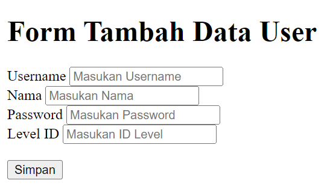

<div align=center>

# <strong> Laporan Praktikum Web Lanjut </strong>

## <strong>2241720107 | Denny Malik Ibrahim | 12 | TI-2H<br><hr>

# <strong> Jobsheet 2 <br> (Routing, Controller, dan View) </strong>

</div>

<br>

## Tugas

Home <br>
Menampilkan halaman awal website (route basic)<br>

<br>

Products <br>
Menampilkan daftar product (route prefix)<br>

<br>
<br>
<br>
<br>

User <br>
Menampilkan profil pengguna (route param)<br>

<br>

Transaksi <br>
Menampilkan halaman transaksi (route basic)<br>


<br>

<hr>
<br>
<br>

<div align=center>

# Jobsheet 3 <br> (Migration, Seeder, DB Facade, Query Builder, dan Eloquent ORM)

</div>

## 😊👉 [Laporan disini](laporan/Jobsheet-3_PWL_DennyMalikIbrahim_TI-2H.pdf) 👈😊

<br>
<hr>
<br>
<br>

<div align=center>

# Jobsheet 4 <br> (Model dan Eloquent ORM)

</div>

<br>

## A. PROPERTI $fillable DAN $guarded

### Praktikum 1 - $fillable

1. Menambahkan $fillable di model UserModel

    ```php
    protected $fillable = ['level_id', 'username', 'nama', 'password'];
    ```

2. Mengubah script pada UserController
    ```php
    public function index()
    {
        $data = [
            'level_id' => 2,
            'username' => 'manager_dua',
            'nama' => 'Manager 2',
            'password' => Hash::make('12345')
        ];
        UserModel::create($data);
        //coba akses model usermodel
        $user = UserModel::all(); //ambil semua data dari tabel m_user
        return view('user', ['data' => $user]);
    }
    ```
3. localhostPWL_POS/public/user<br>
   

    Terlihat ada penambahan data manager 2

4. Mengubah file model UserModel.php

    ```php
    protected $fillable = ['level_id', 'username', 'nama'];
    ```

5. Mengubah bagian array pada $data di UserController

    ```php
    'username' => 'manager_tiga',
    'nama' => 'Manager 3',
    ```

6. localhostPWL_POS/public/user<br>
   

    Terjadi error, karena field password tidak memiliki default valuenya

### $guarded

-- Kebalikan dari $fillable. Semua kolom yang ditambahkan ke $guarded akan **diabaikan** oleh Eloquent ketika melakukan **insert/ update**.
Secara default $guarded isinya array("*"),
berarti semua atribut tidak bisa diset melalui *mass assignment\*.

_Mass Assignment_ adalah fitur canggih yang menyederhanakan proses pengaturan beberapa
atribut model sekaligus, menghemat waktu dan tenaga.

## B. RETRIEVING SINGLE MODELS

### Praktikum 2.1 - Retrieving Single Models

1. Mengubah script pada UserController

    ```php
    $user = UserModel::find(1);
    ```

2. Mengubah view user.blade

    ```php
    <tr>
        <td>{{$data->user_id}} </td>
        <td>{{$data->username}} </td>
        <td>{{$data->nama}} </td>
        <td>{{$data->level_id}} </td>
    </tr>
    ```

3. Hasil<br>
   

4. Mengubah script pada UserController

    ```php
    $user = UserModel::where('level_id', 1)->first();
    ```

5. Hasil<br>
   

6. Mengubah script pada UserController

    ```php
    $user = UserModel::firstWhere('level_id', 1);
    ```

7. Hasil<br>
   <br>

    Ketiga cara diatas adalah cara yang berbeda dengan hasil yang sama<br>

    -- Tindakan lain jika tidak ada hasil lain yang ditemukan menggunakan metode **findOr** dan **firstOr** yang akan mengembalikan satu contoh model atau akan menjalankan didalam fungsi <br>

    ```php
     $user = UserModel::findOr(1, function(){
        // ...
    });

    $user = UserModel::where('level_id', '>', 3)->firstOr(function(){
        // ...
    });
    ```

8. Mengubah script pada UserController

    ```php
    $user = UserModel::findOr(1, ['username', 'nama'], function(){
            abort(404);
    });
    ```

9. Hasil<br>
   <br>

    Data yang keluar hanya username dan nama, pada level_id 1, karena hanya data dari 2 field tersebut yang diambil

10. Mengubah script pada UserController

    ```php
    $user = UserModel::findOr(20, ['username', 'nama'], function(){
            abort(404);
    });
    ```

11. Hasil<br>
    
    Jika tidak ada hasil yang diinginkan, maka akan menjalankan fungsi _abort(404)_

### Praktikum 2.2 - Not Found Exceptions

-- Metode findOrFail dan firstOrFail akan
mengambil hasil pertama dari kueri; namun, jika tidak ada hasil yang ditemukan, sebuah
Illuminate\Database\Eloquent\ModelNotFoundException akan dilempar

1. Mengubah script pada UserController

    ```php
    $user = UserModel::findOrFail(1);
    ```

2. Hasil<br>
   

3. Mengubah script pada UserController

    ```php
    $user = UserModel::where('username', 'manager9')->firstOrFail();
    ```

4. Hasil<br>
   <br>
   Di database tidak ada username 'manager9'

### Praktikum 2.3 - Retreiving Aggregrates

1. Mengubah script pada UserController

    ```php
    $user = UserModel::where('level_id', '2')->count();
    dd($user);
    ```

2. Hasil<br>
   <br>
   'level_id' yang bernilai 2 ada 3

3. Menampilkan seperti dibawah ini

    ```php
     <tr>
        <th>Jumlah Pengguna</th>
    </tr>
    <tr>
        <td>{{$data}}</td>
    </tr>
    ```

    Hasil<br>
    

### Praktikum 2.4 - Retreiving or Creating Models

1. Mengubah script pada UserController

    ```php
    $user = UserModel::firstOrCreate(
        [
            'username' => 'manager',
            'nama' => 'Manager',
        ],
    );
    ```

2. Mengubah view user

    ```php
    <tr>
        <th>ID</th>
        <th>Username</th>
        <th>Nama</th>
        <th>ID Level Pengguna</th>
    </tr>

    <tr>
        <td>{{$data->user_id}} </td>
        <td>{{$data->username}} </td>
        <td>{{$data->nama}} </td>
        <td>{{$data->level_id}} </td>
    </tr>
    ```

3. Hasil<br>
   <br>
   Karena username 'manager' sudah maka, firstoOrCreate hanya mengambil data yang ada

4. Mengubah script pada UserController

    ```php
    $user = UserModel::firstOrCreate(
        [
            'username' => 'manager22',
            'nama' => 'Manager Dua Dua',
            'password' => Hash::make('12345'),
            'level_id' => 2
        ],
    );
    ```

5. Hasil<br>
   <br>
   Karena tidak ada username 'manager22', maka firstoOrCreate memambahkan data tersebut

6. Mengubah script pada UserController

    ```php
    $user = UserModel::firstOrNew(
        [
                'username' => 'manager',
                'nama' => 'Manager',
        ],
    );
    ```

7. Hasil<br>
   <br>
   Hasilnya sama dengan firstOrCreate

8. Mengubah script pada UserController

    ```php
    $user = UserModel::firstOrNew(
        [
            'username' => 'manager33',
            'nama' => 'Manager Tiga Tiga',
            'password' => Hash::make('12345'),
            'level_id' => 2
        ],
    );
    ```

9. Hasil<br>
   <br>
   Username 'manager33' tidak ada di database, dan oleh firstOrNew data akan ditampilkan, namun belum disimpan ke database, oleh karena itu pada saat ditampilkan tidak ada ID nya

10. Mengubah script pada UserController

    ```php
    $user = UserModel::firstOrNew(
        [
           'username' => 'manager33',
            'nama' => 'Manager Tiga Tiga',
            'password' => Hash::make('12345'),
            'level_id' => 2
        ],
    );
    $user->save();
    ```

11. Hasil<br>
    <br>
    Pada firstOrNew perlu adanya tambahan metode save untuk secara manual di simpan di database

### Praktikum 2.5 - Attribute Changes

-- Eloquent menyediakan metode isDirty, isClean, dan wasChanged untuk memeriksa
keadaan internal model
Metode isDirty menentukan apakah ada atribut model yang telah diubah sejak model diambil
Metode isClean akan
menentukan apakah suatu atribut tetap tidak berubah sejak model diambil

1. Mengubah script pada UserController

    ```php
     $user = UserModel::create([
            'username' => 'manager55',
            'nama' => 'Manager55',
            'password' => Hash::make(12345),
            'level_id' => 2,
    ]);

    $user->username = 'manager56';

    $user->isDirty(); // true
    $user->isDirty('username'); // true
    $user->isDirty('nama'); // false
    $user->isDirty(['nama', 'username']); // true

    $user->isClean(); // false
    $user->isClean('username'); // false
    $user->isClean('nama'); // true
    $user->isClean(['nama', 'username']); // false

    $user->save();

    $user->isDirty(); // false
    $user->isClean(); // true
    dd($user->isDirty());
    ```

2. Hasil<br>
   <br>
   Output isDirty() akan false karena setelah di simpan tidak ada perubahan, karena isDirty menentukan apakah ada atribut model yang telah diubah sejak model diambil

3. Mengubah script pada UserController

    ```php
    $user = UserModel::create([
            'username' => 'manager11',
            'nama' => 'Manager11',
            'password' => Hash::make(12345),
            'level_id' => 2,
    ]);

    $user->username = 'manager12';

    $user->save();

    $user->wasChanged(); // true
    $user->wasChanged('username'); // true
    $user->wasChanged(['username', 'level_id']); // true
    $user->wasChanged('nama'); // false
    dd($user->wasChanged(['nama', 'username'])); //true
    ```

4. Hasil<br>
   <br>
   Hasilnya true karena wasChanged memeriksa keadaan internal model dan menentukan bagaimana atributnya berubah sejak model pertama kali diambil.

### Praktikum 2.6 - Create, Read, Update, Delete (CRUD)

1. Mengubah script pada view user

    ```php
    <body>
        <h1>Data User</h1>
        <a href="/user/tambah">+ Tambah User</a>
        <table border="1" cellpadding="2" cellspacing="0">
            <tr>
                <th>ID</th>
                <th>Username</th>
                <th>Nama</th>
                <th>ID Level Pengguna</th>
                <th>Aksi</th>
            </tr>
            @foreach ($data as $d)
                <tr>
                    <td>{{ $d->user_id }} </td>
                    <td>{{ $d->username }} </td>
                    <td>{{ $d->nama }} </td>
                    <td>{{ $d->level_id }} </td>
                    <td><a href="/user/ubah/{{ $d->user_id }}">Ubah</a> | <a href="/user/hapus/{{ $d->user_id }}">Hapus</a></td>
                </tr>
            @endforeach

        </table>
        </body>
    ```

2. Mengubah script pada UserController

    ```php
    $user = UserModel::all();
    return view('user', ['data' => $user]);
    ```

3. Hasil<br>
   <br>
   Terdapat aksi untuk tambah, ubah dan hapus. Tetapi jika di tekan akan error karena masih belum mendefinikan route, view, dan controllernya

4. Menambahkan file user_tambah pada view

    ```php
    <body>
        <h1>Form Tambah Data User</h1>
        <form method="post" action="/user/tambah_simpan">

            {{ csrf_field() }}

            <label for="">Username</label>
            <input type="text" name="username" placeholder="Masukan Username" >
            <br>
            <label for="">Nama</label>
            <input type="text" name="nama" placeholder="Masukan Nama">
            <br>
            <label for="">Password</label>
            <input type="password" name="password" placeholder="Masukan Password">
            <br>
            <label for="">Level ID</label>
            <input type="number" name="level_id" placeholder="Masukan ID Level">
            <br><br>
            <input type="submit" class="btn btn-success" value="Simpan">
        </form>
    </body>
    ```

5. Menambah script pada route

    ```php
    Route::get('/user/tambah', [UserController::class, 'tambah']);
    ```

6. Menambah script pada UserController

    ```php
    public function tambah()
    {
        return view('user_tambah');
    }
    ```

7. Hasil<br>
   

8. Menambah script pada route

    ```php
    Route::get('/user/tambah_simpan', [UserController::class, 'tambah_simpan']);
    ```

9. Menambah script pada UserController

    ```php
    public function tambah_simpan(Request $request)
    {
        UserModel::create([
            'username' => $request->username,
            'nama' => $request->nama,
            'password' => Hash::make('$request->password'),
            'level_id' => $request->level_id
        ]);

        return redirect('/user');
    }
    ```

10. Hasil<br>
    <br>
    <br>
    Setelah mengisi form akan kembali ke halaman user dan terlihat ada data yang ditambahkan

11. Membuat update atau ubah data user

    ```php
    <body>
    <h1>Form Ubah Data User</h1>
    <a href="/user">Kembali</a>
    <br><br>

    <form action="/user/ubah_simpan/{{ $data->user_id }}" method="post">

        {{ csrf_field() }}
        {{ method_field('PUT') }}

        <label for="">Username</label>
        <input type="text" name="username" placeholder="Masukan Username" value="{{ $data->username }}">
        <br>
        <label for="">Nama</label>
        <input type="text" name="nama" placeholder="Masukan Nama" value="{{ $data->nama }}">
        <br>
        <label for="">Password</label>
        <input type="password" name="password" placeholder="Masukan Password" value="{{ $data->password }}">
        <br>
        <label for="">Level ID</label>
        <input type="number" name="level_id" placeholder="Masukan ID Level" value="{{ $data->level_id }}">
        <br><br>
        <input type="submit" class="btn btn-success" value="Ubah">

    </form>
    </body>
    ```

12. Menambah script pada routes

    ```php
    Route::get('/user/ubah/{id}', [UserController::class, 'ubah']);
    ```

13. Menambah script pada UserController

    ```php
    public function ubah($id)
    {
        $user = UserModel::find($id);
        return view('user_ubah', ['data' => $user]);
    }
    ```

14. Hasil<br>
    <br>

15. Menambah script pada routes

    ```php
    Route::put('/user/ubah_simpan/{id}', [UserController::class, 'ubah_simpan']);
    ```

16. Menambah script pada UserController

    ```php
    public function ubah_simpan($id, Request $request)
    {
        $user = UserModel::find($id);

        $user->username = $request->username;
        $user->nama = $request->nama;
        $user->password = Hash::make('$request->password');
        $user->level_id = $request->level_id;

        $user->save();

        return redirect ('/user');
    }
    ```

17. Hasil<br>
    <br>
    Mengubah level_id menjadi 2

    <br>
    Setelah mengubah kembali ke halaman user dengan level_id denny berubah jadi 2

18. Menambah script pada routes

    ```php
    Route::get('/user/hapus/{id}', [UserController::class, 'hapus']);
    ```

19. Menambah script pada UserController

    ```php
    public function hapus($id)
    {
        $user = UserModel::find($id);
        $user->delete();

        return redirect('/user');
    }
    ```

20. Hasil<br>
    <br>
    <br>
    Data denny telah dihapus

### Praktikum 2.7 - Relationships

1. Menambah script pada UserModel

    ```php
    public function level(): BelongsTo
    {
        return $this->belongsTo(LevelModel::class, 'level_id', 'level_id');
    }
    ```

    Lalu membuat model LevelModel dan mengisinya seperti UserModel

2. Mengubah script pada UserController

    ```php
    public function index()
    {
        $user = UserModel::with('level')->get();
        dd($user);
    }
    ```

3. Hasil<br>
   

4. Mengubah script pada UserController

    ```php
    public function index()
    {
        $user = UserModel::with('level')->get();
        return view('user', ['data' => $user]);
    }
    ```

5. Mengubah script view user

    ```php
    <body>
    <h1>Data User</h1>
    <a href="/user/tambah">+ Tambah User</a>
    <table border="1" cellpadding="2" cellspacing="0">
        <tr>
            <th>ID</th>
            <th>Username</th>
            <th>Nama</th>
            <th>ID Level Pengguna</th>
            <th>Kode Level</th>
            <th>Nama Level</th>
            <th>Aksi</th>
        </tr>
        @foreach ($data as $d)
            <tr>
                <td>{{ $d->user_id }} </td>
                <td>{{ $d->username }} </td>
                <td>{{ $d->nama }} </td>
                <td>{{ $d->level_id }} </td>
                <td>{{ $d->level->level_kode }} </td>
                <td>{{ $d->level->level_nama }} </td>
                <td><a href="/user/ubah/{{ $d->user_id }}">Ubah</a> | <a
                        href="/user/hapus/{{ $d->user_id }}">Hapus</a></td>
            </tr>
        @endforeach

    </table>
    </body>
    ```

6. Hasil<br>
   <br>
   Terlihat ada penambahan kolom level kode dan level nama yang diambil dari tabel m_level

<br>
<hr>
<br>
<br>

<div align=center>

# Jobsheet 5 <br> (Blade View, Web Templating(AdminLTE), Datatables)

</div>

<br>

##

### Praktikum 1 – Integrasi Laravel dengan AdminLte3

1. Menjalankan command (composer require jeroennoten/laravel-adminlte), untuk mendefinisikan requirement project <br>
   <br>

2. Melakukan instalasi requirement project di atas dengan command (php artisan adminlte:install)<br>
   <br>

3. Membuat file resources/views/layout/app.blade.php<br>
   <br>
   dan mengisi dengan kode berikut:

    ```php
    @extends('adminlte::page')
    {{-- Extend and customize the browser title --}}
    @section('title')
        {{ config('adminlte.title') }}
        @hasSection('subtitle')
            | @yield('subtitle')
        @endif
    @stop
    {{-- Extend and customize the page content header --}}
    @section('content_header')
        @hasSection('content_header_title')
            <h1 class="text-muted">
                @yield('content_header_title')
                @hasSection('content_header_subtitle')
                    <small class="text-dark">
                        <i class="fas fa-xs fa-angle-right text-muted"></i>
                        @yield('content_header_subtitle')
                    </small>
                @endif
            </h1>
        @endif
    @stop
    {{-- Rename section content to content_body --}}
    @section('content')
        @yield('content_body')
    @stop
    {{-- Create a common footer --}}
    @section('footer')
        <div class="float-right">
            Version: {{ config('app.version', '1.0.0') }}
        </div>
        <strong>
            <a href="{{ config('app.company_url', '#') }}">
                {{ config('app.company_name', 'My company') }}
            </a>
        </strong>
    @stop
    {{-- Add common Javascript/Jquery code --}}
    @push('js')
        <script>
            $(document).ready(function() {
                // Add your common script logic here...
            });
        </script>
    @endpush
    {{-- Add common CSS customizations --}}
    @push('css')
        <style type="text/css">
            {{-- You can add AdminLTE customizations here --}}
            /*
            .card-header {
                border-bottom: none;
            }
            .card-title {
                font-weight: 600;
            }
            */
        </style>
    @endpush
    ```

4. Mengedit resources/views/welcome.blade.php dan mereplace dengan kode berikut

5. Menuju ke browser
   

### Praktikum 2 – Integrasi dengan DataTables

1. Menginstall laravel data tabel<br>

    - composer require laravel/ui --dev
    - composer require yajra/laravel-datatables:^10.0<br>

    <br>
    <br>

2. Melakukan perintah npm -v<br>
   <br>

3. Menginstall Laravel DataTables Vite dan sass<br>

    - npm i laravel-datatables-vite --save-dev
    - npm install -D sass<br>

    <br>
    

4. Mengedit file resources/js/app.js

    ```php
    import './bootstrap';
    import "../sass/app.scss";
    import 'laravel-datatables-vite';
    ```

5. Membuat file resources/saas/app.scss

    ```php
    // Fonts
    @import url('https://fonts.bunny.net/css?family=Nunito');


    // Bootstrap
    @import 'bootstrap/scss/bootstrap';

    // DataTables
    @import 'bootstrap-icons/font/bootstrap-icons.css';
    @import "datatables.net-bs5/css/dataTables.bootstrap5.min.css";
    @import "datatables.net-buttons-bs5/css/buttons.bootstrap5.min.css";
    @import 'datatables.net-select-bs5/css/select.bootstrap5.css';
    ```

6. Menjalankan npm run dev<br>
   <br>

7. Membuat datatables untuk kategori<br>
   

8. Mengedit KategoriDatable untuk mengatur kolom apasaja yang ingin ditampilkan<br>

    ```php
    <?php

    namespace App\DataTables;

    use App\Models\KategoriModel;
    use Illuminate\Database\Eloquent\Builder as QueryBuilder;
    use Yajra\DataTables\EloquentDataTable;
    use Yajra\DataTables\Html\Builder as HtmlBuilder;
    use Yajra\DataTables\Html\Button;
    use Yajra\DataTables\Html\Column;
    use Yajra\DataTables\Html\Editor\Editor;
    use Yajra\DataTables\Html\Editor\Fields;
    use Yajra\DataTables\Services\DataTable;

    class KategoriDataTable extends DataTable
    {
        /**
         * Build the DataTable class.
         *
         * @param QueryBuilder $query Results from query() method.
         */
        public function dataTable(QueryBuilder $query): EloquentDataTable
        {
            return (new EloquentDataTable($query))
    /*             ->addColumn('action', 'kategori.action') */
                ->setRowId('id');
        }

        /**
         * Get the query source of dataTable.
         */
        public function query(KategoriModel $model): QueryBuilder
        {
            return $model->newQuery();
        }

        /**
         * Optional method if you want to use the html builder.
         */
        public function html(): HtmlBuilder
        {
            return $this->builder()
                        ->setTableId('kategori-table')
                        ->columns($this->getColumns())
                        ->minifiedAjax()
                        //->dom('Bfrtip')
                        ->orderBy(1)
                        ->selectStyleSingle()
                        ->buttons([
                            Button::make('excel'),
                            Button::make('csv'),
                            Button::make('pdf'),
                            Button::make('print'),
                            Button::make('reset'),
                            Button::make('reload')
                        ]);
        }

        /**
         * Get the dataTable columns definition.
         */
        public function getColumns(): array
        {
            return [
        /*         Column::computed('action')
                    ->exportable(false)
                    ->printable(false)
                    ->width(60)
                    ->addClass('text-center'), */
                Column::make('kategori_id'),
                Column::make('kategori_kode'),
                Column::make('kategori_nama'),
                Column::make('created_at'),
                Column::make('updated_at'),
            ];
        }

        /**
         * Get the filename for export.
         */
        protected function filename(): string
        {
            return 'Kategori_' . date('YmdHis');
        }
    }
    ```

9. Mengubah kategori model

    ```php
    <?php

    namespace App\Models;

    use Illuminate\Database\Eloquent\Model;
    use Illuminate\Database\Eloquent\Relations\HasMany;

    class KategoriModel extends Model
    {
        protected $table = 'm_kategori';
        protected $primaryKey = 'kategori_id';
        protected $fillable = ['kategori_kode', 'kategori_nama'];

        public function barang(): HasMany
        {
            return $this->hasMany(BarangModel::class, 'barang_id', 'barang_id');
        }
    }
    ```

10. Mengubah Kategori Controller

    ```php
    public function index(KategoriController $dataTable)
        {
            return $dataTable->render('kategori.index');
    ```

11. Membuat folder kategori di view

    ```php
    @extends('layouts.app')

    {{-- Customize layout sections --}}

    @section('subtitle', 'Kategori')
    @section('content_header_title', 'Home')
    @section('content_header_subtitle', 'Kategori')

    @section('content')
        <div class="container">
            <div class="card">
                <div class="card-header">Manage Kategori</div>
                <div class="card-body">
                    {{ $dataTable->table() }}
                </div>
            </div>
        </div>
    @endsection

    @push('scripts')
        {{ $dataTable->scripts() }}
    @endpush
    ```

12. Memastikan route kategori tersedia

    ```php
    Route::get('/kategori', [KategoriController::class, 'index']);
    ```

13. Menyesuaikan app layout

    ```php
    @extends('adminlte::page')
    {{-- Extend and customize the browser title --}}
    @section('title')
        {{ config('adminlte.title') }}
        @hasSection('subtitle')
            | @yield('subtitle')
        @endif
    @stop
    @vite('resources/js/app.js')
    {{-- Extend and customize the page content header --}}
    @section('content_header')
        @hasSection('content_header_title')
            <h1 class="text-muted">
                @yield('content_header_title')
                @hasSection('content_header_subtitle')
                    <small class="text-dark">
                        <i class="fas fa-xs fa-angle-right text-muted"></i>
                        @yield('content_header_subtitle')
                    </small>
                @endif
            </h1>
        @endif
    @stop

    {{-- Rename section content to content_body --}}

    @section('content')
        @yield('content_body')
    @stop


    {{-- Create a common footer --}}

    @section('footer')
        <div class="float-right">
            Version: {{ config('app.version', '1.0.0') }}
        </div>

        <strong>
            <a href="{{ config('app.company_url', '#') }}">
                {{ config('app.company_name', 'My company') }}
            </a>
        </strong>
    @stop


    {{-- Add common Javascript/Jquery code --}}


    @push('js')
        <script src="https://cdn.datatables.net/2.0.2/js/dataTables.js"></script>
    @endpush

    @stack('scripts')


    {{-- Add common CSS customizations --}}

    @push('css')
        <link rel="stylesheet" href="https://cdn.datatables.net/2.0.2/css/dataTables.dataTables.css" />
        <style type="text/css">
            {{-- You can add AdminLTE customizations here --}}
            /*
        .card-header {
        border-bottom: none;
        }
        .card-title {
        font-weight: 600;
        }
        */
        </style>
    @endpush
    ```

14. Menset ViteJs / script type defaults

    ```php
    <?php

    namespace App\Providers;

    use Illuminate\Support\ServiceProvider;
    use Yajra\DataTables\Html\Builder;

    class AppServiceProvider extends ServiceProvider
    {
        /**
         * Register any application services.
         */
        public function register(): void
        {
            //
        }

        /**
         * Bootstrap any application services.
         */
        public function boot(): void
        {
            Builder::useVite();
        }
    }
    ```

15. Melihat data kategori
    

### Praktikum 3 – Membuat form kemudian menyimpan data dalam database

1. Menambahkan 2 routing

    ```php
    Route::get('/kategori/create', [KategoriController::class, 'create']);
    Route::post('/kategori', [KategoriController::class, 'store']);
    ```

2. Menambahkan 2 function dalam KategoriController

    ```php
    public function create()
        {
            return view('kategori.create');
        }

        public function store(Request $request)
        {
            KategoriModel::create([
                'kategori_kode' => $request->kodeKategori,
                'kategori_nama' => $request->namaKategori,
            ]);
            return redirect('/kategori');
        }
    ```

3. Membuat file create.blade di views/kategori

    ```php
    @extends('layouts.app')

    {{-- Customize layout sections --}}

    @section('subtitle', 'Kategori')
    @section('content_header_title', 'Kategori')
    @section('content_header_subtitle', 'Create')

    @section('content')
        <div class="container">
            <div class="card card-primary">
                <div class="card-header">
                    <h3 class="card-title">Buat Kategori Baru</h3>
                </div>

                <form action="../kategori" method="post">
                    <div class="card-body">
                        <div class="form-group">
                            <label for="kodeKategori">Kode Kategori</label>
                            <input type="text" class="form-control" name="kodeKategori" id="kodeKategori" placeholder="Masukkan kode kategori">
                        </div>
                        <div class="form-group">
                            <label for="namaKategori">Nama Kategori</label>
                            <input type="text" class="form-control" name="namaKategori" id="namaKategori" placeholder="Masukkan nama kategori">
                        </div>
                    </div>

                    <div class="card-footer">
                        <button type="submit" class="btn btn-primary">Submit</button>
                    </div>
                </form>
            </div>
        </div>
    @endsection
    ```

4. Melakukan pengecualian proteksi CsrfToken pada file VerifyCsrfToken

    ```php
    protected $except = [
            '/kategori'
    ];
    ```

5. Mengakses kategori/create<br>
    

6. Mengakses halaman kategori<br>
    

